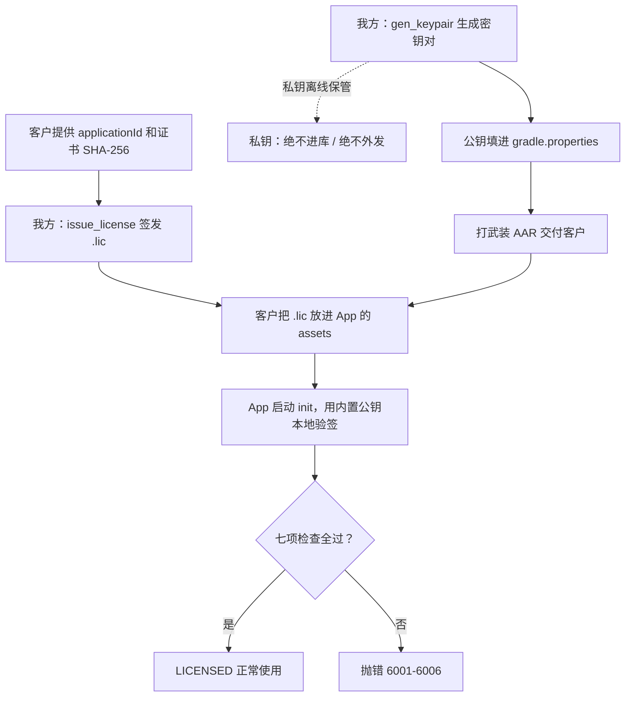

# 离线授权（License）机制详解（对内扫盲）

适用 SDK 版本：0.2.x 起。

这份文档写给公司内部同事，尤其是第一次接触商业 SDK 授权的人。目标是让你不需要密码学背景，也能讲清楚：我们的 SDK 怎么鉴权、为什么这样是安全的、实际怎么操作、哪里会泄漏以及怎么防。

和其他文档的分工：

| 文档 | 内容 |
| --- | --- |
| 本文 | 原理 + 操作 + 防泄漏，扫盲入门 |
| LICENSING.md | 行业调研、方案为什么这么选、防破解的技术边界 |
| DELIVERY.md §11 | 签发 / 计费 / 续费 / 审计 / 吊销的标准操作流程 |
| INTEGRATION.md §14 | 给客户看的接入步骤 |
| tools/license/README.md | ASR/TTS 统一签发工具的命令说明 |

## 1. 先看懂几个词

| 词 | 一句话解释 |
| --- | --- |
| license | 一份授权凭证，表示某个 App 被允许使用我们的 SDK |
| .lic 文件 | license 的实际载体，一个文本文件，里面是授权信息加一段签名 |
| 鉴权 | SDK 启动时检查这份 license 是不是真的、是不是发给当前 App 的、有没有过期 |
| 私钥 | 一串只有我方持有的秘密数据，用来给 .lic 生成签名 |
| 公钥 | 与私钥配套的另一串数据，可以公开，用来检验签名，但不能用来生成签名 |
| 签名 | 用私钥对授权信息算出的一串数据，附在 .lic 里 |
| 验签 | 用公钥检查这段签名确实是这段授权信息配我方私钥算出来的 |
| applicationId | App 的包名，例如 com.acme.talkie，Android 上每个 App 唯一 |
| 签名证书 | App 上架时用的开发者证书；它的 SHA-256 是一串固定指纹，换证书就会变 |
| 武装构建 | 打包 SDK 时注入了我方公钥的版本，会真正鉴权 |
| 未武装构建 | 没注入公钥的版本，不鉴权，仅供内部 / 评测使用 |
| 装机量 | 这份授权允许安装的设备规模，按合同档位约定 |

## 2. 我们用的是哪种鉴权方式

一句话：离线、基于数字签名、绑定到具体 App。

拆开说：

- 离线：鉴权全程在用户设备本地完成，SDK 不联网、不向任何服务器汇报。这是为了守住我们 SDK 的核心卖点——零网络权限。
- 基于数字签名：每份 .lic 都由我方用私钥签过名，SDK 用内置的公钥检验这个签名。
- 绑定到具体 App：.lic 里写明了它授权给哪个 applicationId、哪个签名证书，换 App 就失效。

为什么不做联网激活按设备计数那种方式：那需要联网、采集设备标识、自建服务器，会破坏零网络和隐私干净两个卖点。代价是我们没法精确实测真实装机数，改用合同约定的档位加抽样审计来约束。

## 3. 原理：为什么别人伪造不了

安全性来自数字签名的三条性质，不需要记公式，只要记住结论：

1. 私钥能算出签名，公钥算不出。私钥和公钥是配套的一对。只有拿着私钥的人，才能对一段内容算出一个能通过检验的签名。
2. 内容改一个字节，签名就失效。只要 .lic 里的授权信息被改动（哪怕只是把到期日从 2026 改成 2099），原来的签名就无法通过检验。
3. 从公钥推不出私钥。公钥可以公开，别人拿到公钥也算不出私钥。

我们就是这样用的：

- 私钥只有我方有，用来签发 .lic。
- 公钥放进 SDK（打包进 AAR）。公钥被人看到没关系，见性质 3。
- SDK 用公钥验签。别人没有私钥，造不出能通过验签的 .lic；改 .lic 内容会让验签失败。

结论：攻击者无法凭空造出一份有效 license，也无法篡改一份已有 license。

补充：我们用的具体算法叫 ECDSA P-256 加 SHA256。选它是因为它在很老的 Android 系统（7.0 起）也内置支持，而且签名、公钥都很短。你不需要懂它的内部，只要知道它就是上面说的数字签名。

## 4. 一份 .lic 里装了什么

.lic 是一个文本文件，分两块：授权信息和签名。

授权信息里的字段：

| 字段 | 含义 |
| --- | --- |
| applicationId | 授权给哪个 App 的包名（必填） |
| certSha256 | 绑定的签名证书指纹；空表示不绑证书 |
| customer | 客户名 |
| licenseId | 授权编号，我方台账用 |
| issuedAt | 签发日期 |
| expiresAt | 到期日期；空表示永久（买断） |
| installTier | 装机量档位标识（声明性，仅记录用） |
| features | 授权能力列表，仅允许 ASR、TTS |
| sdkMajor | 兼容的 SDK 大版本 |

签名块：用我方私钥对上面那段授权信息算出的签名。SDK 验签时，就是用公钥检验这段签名配不配那段授权信息。

你不需要手写 .lic，它由签发工具生成，见 §6。

## 5. 鉴权时 SDK 到底检查了哪几件事

App 启动调用 AmphionRuntime.init 时，SDK 按顺序检查：

| 顺序 | 检查 | 防住的情况 | 失败错误码 |
| --- | --- | --- | --- |
| 1 | 当前构建是否武装 | 未武装构建直接跳过后面全部检查（内部 / 评测用） | 无，状态为 DEV_UNLICENSED |
| 2 | 有没有 .lic | 客户漏放授权文件 | 6001 |
| 3 | .lic 格式对不对 | 文件损坏 | 6002 |
| 4 | 签名能否通过验证 | 伪造的或被篡改的 .lic | 6003 |
| 5 | applicationId 是否一致 | 把别家的 .lic 拿来用，或改包名复用 | 6004 |
| 6 | 签名证书是否一致 | 换开发者证书重打包复用 | 6005 |
| 7 | 有没有过期 | 到期不续费还想用 | 6006 |

全过表示授权有效（状态 LICENSED）。武装构建下默认策略 ENFORCE 会在任一检查失败时让 init 直接抛异常，App 起不来；另有 PERMISSIVE 策略只记录不拦截，用于灰度，详见 INTEGRATION.md §14。

## 6. 完整流程



分四个阶段：

### 6.1 我方一次性准备（整个产品线只做一次）

```bash
python tools/license/gen_keypair.py --out-private ~/secure/amphion-license-private.pem
```

把输出的公钥 base64 填进 asr/android/gradle.properties 的 AMPHION_LICENSE_PUBLIC_KEY。从此打出来的就是武装包。私钥收进安全位置，绝不进库。

### 6.2 每个客户签发一次

先收集客户的 applicationId（必填）和 release 签名证书 SHA-256（建议绑，更安全）。证书指纹让客户这样导出：

```bash
keytool -list -v -keystore <客户的release.keystore> -alias <alias> | grep "SHA256:"
```

然后签发：

```bash
python tools/license/issue_license.py \
  --private-key ~/secure/amphion-license-private.pem \
  --application-id <客户包名> --customer "<客户名>" --license-id <编号> \
  --expires <到期日或留空=永久> --install-tier <档位> \
  --features <逗号分隔功能> --cert-sha256 <证书指纹或留空> \
  --out <客户包名>.lic
```

签完本地自测一下，确认能过：

```bash
python tools/license/verify_license.py --license <客户包名>.lic \
  --private-key ~/secure/amphion-license-private.pem --application-id <客户包名>
```

### 6.3 客户接入

把 .lic 发给客户，客户放进自己 App 的 assets，默认文件名 amphion-license.lic。客户侧代码无需改动，AmphionRuntime.init 会自动读取并验签。

### 6.4 运行时

App 每次启动 init 时本地验签，不联网。结果可用 AmphionRuntime.licenseStatus() 查询（例如在「关于」页展示客户名、到期日）。

## 7. 能防住什么，防不住什么

诚实说清楚边界，避免误判这套方案的能力。

能防住：

| 攻击 | 为什么防得住 |
| --- | --- |
| 凭空伪造一份 license | 没有私钥，造不出能通过验签的签名 |
| 篡改 license（改到期日 / 改功能） | 改任何内容都会让签名失效（6003） |
| 把 A 客户的 .lic 给 B 客户用 | applicationId / 证书绑定不符（6004 / 6005） |
| 改包名重打包复用 | 包名与 license 不符（6004） |

防不住（离线方案的固有上限）：

| 情况 | 说明 |
| --- | --- |
| 逆向者反编译 SDK，直接删掉验签代码 | 代码在客户设备上，理论上可被改 |
| 逆向者替换 AAR 里内置的公钥，用自己的私钥发证 | 同上 |
| 精确限制装机台数 | 离线不联网，无法实测台数 |

对防不住的部分，我们的应对是：release 开启代码混淆（R8）把验签逻辑搅乱，抬高逆向成本；再加合同与法务条款兜底。这不是绝对防线，是提高成本。要更强可上 Phase 2（验签逻辑下沉到 native .so、设备绑定硬限台数），见 LICENSING.md §7。

## 8. 怎么防止泄漏（重点）

### 8.1 三样东西，泄漏后果完全不同

先分清谁重要：

| 东西 | 泄漏后果 | 保密级别 |
| --- | --- | --- |
| 私钥 | 灾难：任何人都能签发有效 license，整个授权体系失守 | 绝密 |
| .lic | 有限：只能用在它绑定的那个 applicationId / 证书上 | 一般 |
| 公钥 / AAR 里的验签代码 | 几乎无影响：公钥本就该公开 | 公开 |

记住一句话：要严防的是私钥，不是 .lic，更不是公钥。

### 8.2 私钥怎么防（最重要）

平时：

- 不进 git（仓库 .gitignore 已忽略 *-private.pem 和 tools/license 下的 .pem / .lic）。
- 不放 CI、不放共享盘明文、不在聊天工具里发。
- 存进密码管理器 / KMS / 保险库，生成时用 --password 加口令加密。
- 限制能接触私钥的人数，并登记。

万一私钥泄漏：唯一彻底的补救是换一对新密钥（公钥轮换）——用新私钥重打 SDK，并给所有在用客户重签 .lic。代价很大，会惊动全部客户，所以平时必须严防。步骤见 DELIVERY.md §11.8。

### 8.3 .lic 怎么防

.lic 即使泄漏，别人也只能用在它绑定的 applicationId（加证书）上，挪不到别的 App，所以保密要求远低于私钥。但仍然：

- 不进库（已 gitignore）。
- 按客户单独签发、单独发送，不要把一份 .lic 群发给多个客户。

### 8.4 公钥和验签代码

- 公钥写进 AAR 没问题。它被反编译看到也无所谓，因为公钥只能验签不能签发。
- 验签代码如果是明文，逆向者可能直接改代码跳过验签。所以 release 构建开了 R8 混淆，把这部分逻辑搅乱，抬高门槛。改 SDK 构建配置时不要把混淆关掉。

## 9. 常见疑问

把公钥打进 App，别人反编译拿到公钥，能伪造 license 吗？
不能。公钥只能验签、不能签发，见 §3。

客户把 .lic 转给另一家公司用，行吗？
不行。.lic 绑定了 applicationId（和证书），换 App 验签过不了（6004 / 6005）。

客户设备断网能用吗？
能。鉴权全程离线，不需要网络。

我们能远程关掉某个客户的授权吗？
离线方案不能主动召回已发出的 .lic。实际手段是签发时设较短有效期，到期不续就自然失效，这也是推荐订阅制的原因。详见 DELIVERY.md §11.7。

装机量怎么算，真能限制台数吗？
当前方案不联网、不实测台数，按合同档位加抽样审计约束。要硬限台数需要 Phase 2 的设备绑定方案。

内部开发、跑 sample 也要 .lic 吗？
不要。默认 gradle.properties 公钥为空就是未武装，不鉴权。只有正式交付构建才注入公钥。

客户换了签名证书或包名怎么办？
需要把新的 applicationId / 证书 SHA-256 给我方，用新信息重签一份 .lic。

## 10. 速查

| 我想做 | 怎么做 |
| --- | --- |
| 生成密钥对 | python tools/license/gen_keypair.py --out-private <路径> |
| 给客户签发 .lic | python tools/license/issue_license.py（参数见 §6.2） |
| 本地验一份 .lic | python tools/license/verify_license.py（参数见 §6.2） |
| 一键自测整条链路 | bash tools/license/selftest.sh |
| 让构建开始鉴权 | 公钥填进 gradle.properties 的 AMPHION_LICENSE_PUBLIC_KEY |
| 查错误码含义 | 本文 §5 或 INTEGRATION.md §7 |
| 完整签发 / 续费 / 吊销流程 | DELIVERY.md §11 |
| 方案选型与防破解边界 | LICENSING.md |
