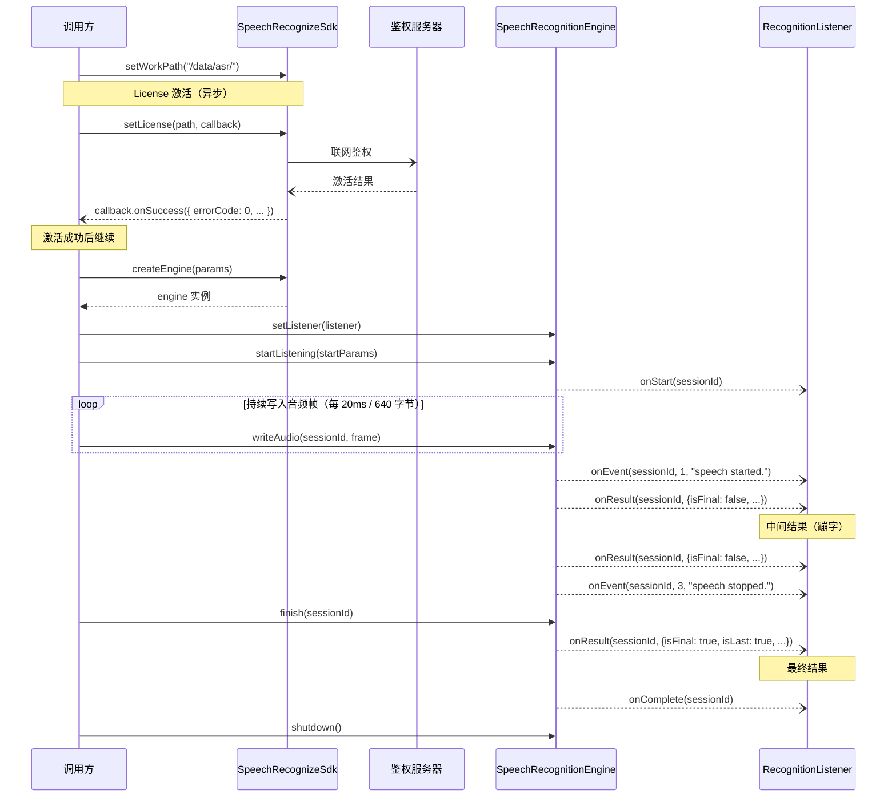
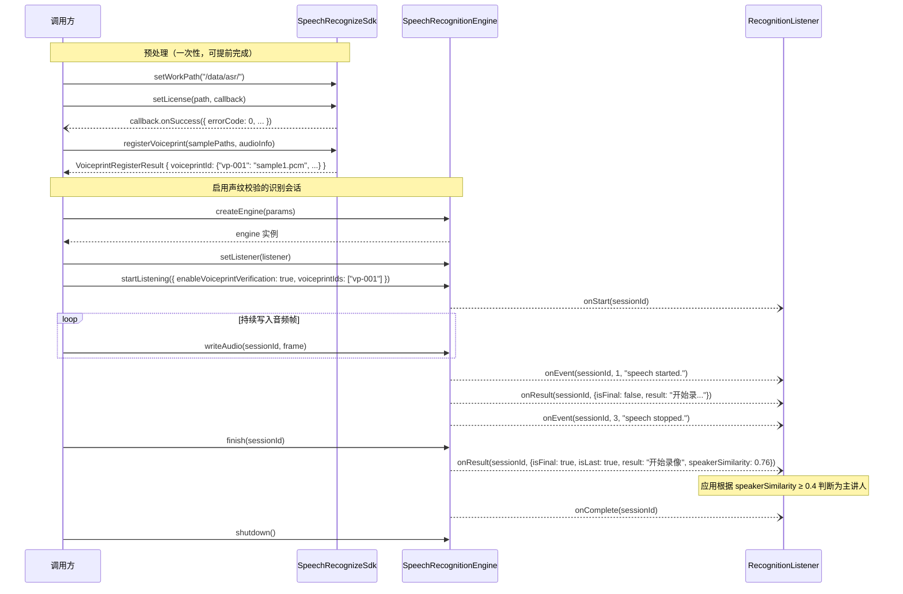

# 语音识别 SDK 接口文档

> 本文档为**语言无关的抽象接口定义**，不绑定具体平台或实现语言。
> 参考来源：华为 HarmonyOS Core Speech Kit — `speechRecognizer` API（ArkTS）

## 变更记录

| 日期 | 版本 | 变更内容 | 作者 |
|------|------|----------|------|
| 2026-06-22 | v1.1 | 新增 License 接口：`setLicense`（#12）、`getLicenseInfo`（#13）；新增 `LicenseInfo`、`LicenseActivationResult` 数据结构；新增错误码 1002200030~1002200035；更新典型调用时序 | — |
| — | v1.0 | 初始版本 | — |

---

## 概述

语音识别 SDK 提供将音频流实时转换为文本的能力，支持**流式输入**与**事件回调**两种机制，适用于实时语音交互、语音指令识别等场景。

**约束**

| 项目 | 说明 |
|------|------|
| 语种 | 中文（`zh-CN`） |
| 运行模式 | 离线（Offline） |
| 音频格式 | PCM，16000 Hz，16bit，单声道 |
| 每帧大小 | 640 字节（对应 20ms）~~或 1280 字节（对应 40ms）~~ |
| 最大音频时长 | 短语音模式：20000–60000 ms；长语音模式：20000–28800000 ms |

---

## 接口列表

| # | 接口 | 所属对象 | 说明 |
|---|------|----------|------|
| 1 | `createEngine` | `SpeechRecognizeSdk` | 创建并初始化引擎实例 |
| 2 | `setListener` | `SpeechRecognitionEngine` | 注册识别回调监听器 |
| 3 | `startListening` | `SpeechRecognitionEngine` | 启动语音识别会话 |
| 4 | `writeAudio` | `SpeechRecognitionEngine` | 写入音频帧数据 |
| 5 | `finish` | `SpeechRecognitionEngine` | 结束识别，触发最终结果 |
| 6 | `cancel` | `SpeechRecognitionEngine` | 取消识别，不触发结果 |
| 7 | `isBusy` | `SpeechRecognitionEngine` | 查询引擎繁忙状态 |
| 8 | `shutdown` | `SpeechRecognitionEngine` | 销毁引擎，释放资源 |
| 9 | `setWorkPath` | `SpeechRecognizeSdk` | 指定 SDK 文件读写工作路径 |
| 10 | `registerVoiceprint` | `SpeechRecognizeSdk` | 注册声纹，生成声纹 ID |
| 11 | `deleteVoiceprint` | `SpeechRecognizeSdk` | 删除已注册声纹 |
| 12 | `setLicense` | `SpeechRecognizeSdk` | 设置 License 文件路径，异步激活并校验 |
| 13 | `getLicenseInfo` | `SpeechRecognizeSdk` | 查询 License 状态及授权信息 |

---

## 一、创建引擎

### 方法签名

```
SpeechRecognizeSdk.createEngine(params: CreateEngineParams, callback: Callback<SpeechRecognitionEngine>) -> void
SpeechRecognizeSdk.createEngine(params: CreateEngineParams) -> Promise<SpeechRecognitionEngine>
```

> 支持回调和 Promise 两种异步模式，实现语言按实际能力选择其一或同时提供。

### 参数说明

| 参数 | 类型 | 必填 | 说明 |
|------|------|------|------|
| params | CreateEngineParams | 是 | 引擎初始化配置，见 [CreateEngineParams](#createengineparams) |
| callback | Callback\<SpeechRecognitionEngine\> | 否 | 异步回调；与 Promise 模式二选一 |

### 返回值

| 类型 | 说明 |
|------|------|
| SpeechRecognitionEngine | 已初始化的引擎实例 |

### 错误码

| 错误码 | 说明 |
|--------|------|
| 1002200001 | 创建引擎失败（语种不支持、资源不存在、初始化超时等） |
| 1002200006 | 引擎繁忙（已有其他会话占用） |
| 1002200008 | 引擎已被销毁 |
| 1002200009 | 内部服务错误 |

### 伪代码示例

```pseudocode
params = CreateEngineParams {
    language: "zh-CN",
    online: OFFLINE,
    extraParams: {
        locate: "CN",
        recognizerMode: "short"
    }
}

engine = SpeechRecognizeSdk.createEngine(params)
```

---

## 二、注册监听器

### 方法签名

```
engine.setListener(listener: RecognitionListener) -> void
```

> **必须**在调用 `startListening` 之前设置，否则无法收到识别结果和错误回调。

### 参数说明

| 参数 | 类型 | 必填 | 说明 |
|------|------|------|------|
| listener | RecognitionListener | 是 | 回调对象，见 [RecognitionListener](#recognitionlistener) |

---

## 三、启动识别

### 方法签名

```
engine.startListening(params: StartParams) -> void
```

### 参数说明

| 参数 | 类型 | 必填 | 说明 |
|------|------|------|------|
| params | StartParams | 是 | 会话配置，见 [StartParams](#startparams) |

### 错误码

| 错误码 | 说明 |
|--------|------|
| 1002200002 | 启动识别失败 |
| 1002200007 | 引擎未初始化 |

### 伪代码示例

```pseudocode
startParams = StartParams {
    sessionId: "session-001",
    audioInfo: AudioInfo {
        audioType: "pcm",
        sampleRate: 16000,
        sampleBit: 16,
        soundChannel: 1
    },
    extraParams: {
        recognitionMode: STREAM,
        vadBegin: 2000,
        vadEnd: 800,
        maxAudioDuration: 30000,
        enablePartialResult: true
    }
}

engine.startListening(startParams)
```

---

## 四、写入音频流

### 方法签名

```
engine.writeAudio(sessionId: String, audio: ByteArray) -> void
```

### 参数说明

| 参数 | 类型 | 必填 | 说明 |
|------|------|------|------|
| sessionId | String | 是 | 会话唯一标识，与 `startListening` 中保持一致 |
| audio | ByteArray | 是 | PCM 音频帧，仅支持 **640 字节**（20ms）~~或 **1280 字节**（40ms）~~ |

> **调用频率**：两次 `writeAudio` 调用间隔须为 20ms（640 字节帧）~~或 40ms（1280 字节帧）~~，与实时采集节奏对齐。

### 错误码

| 错误码 | 说明 |
|--------|------|
| 1002200003 | 超过最大音频时长 |
| 1002200007 | 引擎未初始化 |
| 1002200010 | `startListening` 未成功，无法写入音频 |

---

## 五、结束识别

### 方法签名

```
engine.finish(sessionId: String) -> void
```

调用后引擎完成剩余音频解码，通过 `onResult`（`isFinal=true`）和 `onComplete` 回调返回最终识别结果。

### 参数说明

| 参数 | 类型 | 必填 | 说明 |
|------|------|------|------|
| sessionId | String | 是 | 会话唯一标识 |

### 错误码

| 错误码 | 说明 |
|--------|------|
| 1002200004 | 结束识别失败 |
| 1002200007 | 引擎未初始化 |

---

## 六、取消识别

### 方法签名

```
engine.cancel(sessionId: String) -> void
```

立即终止当前会话，**不触发** `onResult` 和 `onComplete`，已识别的中间结果全部丢弃。

### 参数说明

| 参数 | 类型 | 必填 | 说明 |
|------|------|------|------|
| sessionId | String | 是 | 会话唯一标识 |

### 错误码

| 错误码 | 说明 |
|--------|------|
| 1002200005 | 取消识别失败 |
| 1002200007 | 引擎未初始化 |

---

## 七、查询繁忙状态

### 方法签名

```
engine.isBusy() -> Boolean
```

### 返回值

| 返回值 | 说明 |
|--------|------|
| true | 引擎当前处于繁忙状态（识别进行中） |
| false | 引擎空闲，可发起新会话 |

---

## 八、销毁引擎

### 方法签名

```
engine.shutdown() -> void
```

释放引擎占用的所有资源（模型、线程、内存等）。调用后不可再使用该实例，需重新调用 `createEngine`。

---

## 九、指定工作路径

### 方法签名

```
SpeechRecognizeSdk.setWorkPath(workPath: String) -> void
```

为 SDK 指定文件系统工作目录。SDK 存在持久化文件读写需求（如声纹特征文件）时，统一读写此路径；调用方须确保该路径对 SDK 进程可读写。

> 应在 `createEngine` 之前调用；若不调用，SDK 使用平台默认路径（不同实现平台行为不同）。

### 参数说明

| 参数 | 类型 | 必填 | 说明 |
|------|------|------|------|
| workPath | String | 是 | 分配给 SDK 的可读写目录路径 |

---

## 十、声纹注册

### 方法签名

```
SpeechRecognizeSdk.registerVoiceprint(params: VoiceprintRegisterParams) -> VoiceprintRegisterResult
```

传入 3~5 条声纹样本音频，提取声纹特征并持久化存储，返回声纹 ID 供后续识别会话引用。

> 声纹注册为**一次性预处理**操作，与识别会话生命周期无关，可在任意时刻提前完成。  
> 样本音频须与识别引擎输入流使用**相同的采集参数**（设备、采样率、算法），否则声纹特征不匹配。

### 参数说明

见数据结构 [VoiceprintRegisterParams](#voiceprintregisterparams)。

### 返回值

见数据结构 [VoiceprintRegisterResult](#voiceprintregisterresult)。

### 错误码

| 错误码 | 说明 |
|--------|------|
| 1002200020 | 注册失败（通用） |
| 1002200021 | 样本数量不符，须为 3~5 条 |
| 1002200022 | 样本时长不符，每条须为 3~8s |

---

## 十一、声纹删除

### 方法签名

```
SpeechRecognizeSdk.deleteVoiceprint(voiceprintId: String) -> void
```

删除指定声纹 ID 对应的特征文件，释放存储空间。删除后该 ID 失效，启用此 ID 的识别会话将触发错误。

### 参数说明

| 参数 | 类型 | 必填 | 说明 |
|------|------|------|------|
| voiceprintId | String | 是 | 要删除的声纹 ID |

### 错误码

| 错误码 | 说明 |
|--------|------|
| 1002200024 | 声纹 ID 不存在 |

---

## 十二、设置 License

**所属对象**：`SpeechRecognizeSdk`

**方法签名**

```
SpeechRecognizeSdk.setLicense(licensePath: String, callback: Callback<LicenseActivationResult>) -> void
```

> License 鉴权可能耗时较长，因此采用异步回调模式，鉴权完成后通过 `callback` 通知结果。
> 应在 `createEngine` 之前调用。若已设置过 License，再次调用将覆盖。
>
> 应用 License 激活后，除非应用数据被清除（恢复出厂设置），否则不必每次启动 SDK 都进行激活。
>
> TTS 使用相同的 License 接口，后续安菲翁 ASR 和 TTS SDK 合一后，方便收编。当前需要使用两个 SDK AAR 分别调用授权。

**参数说明**

| 参数 | 类型 | 必填 | 说明 |
|------|------|------|------|
| licensePath | String | 是 | License 文件的绝对路径 |
| callback | Callback\<LicenseActivationResult\> | 是 | 异步鉴权结果回调，见 [LicenseActivationResult](#licenseactivationresult) |

**错误码**

| 错误码 | 说明 |
|--------|------|
| 1002200030 | License 文件不存在或无法读取 |
| 1002200031 | License 格式无效或解析失败 |
| 1002200032 | License 已过期 |
| 1002200033 | License 与当前设备不匹配（设备指纹校验失败） |
| 1002200035 | License 激活超时或激活失败（如鉴权服务器不可达） |

**伪代码示例**

```pseudocode
SpeechRecognizeSdk.setLicense("/data/license/asr_license.lic", callback = Callback {
    onSuccess(result: LicenseActivationResult):
        log("License 激活成功，剩余 " + result.remainingDays + " 天")
        log("授权功能: " + result.authorizedFeatures.join(", "))
        // 激活成功后调用 createEngine

    onError(errorCode: Int, errorMessage: String):
        log("License 激活失败，error=" + errorCode + " msg=" + errorMessage)
})
```

---

## 十三、查询 License 信息

**所属对象**：`SpeechRecognizeSdk`

**方法签名**

```
SpeechRecognizeSdk.getLicenseInfo() -> LicenseInfo
```

> 查询当前已设置 License 的详细信息，用于调用方判断 License 有效性及授权范围。

**返回值**

| 类型 | 说明 |
|------|------|
| LicenseInfo | License 信息，见 [LicenseInfo](#licenseinfo) |

**错误码**

| 错误码 | 说明 |
|--------|------|
| 1002200034 | 未设置 License（尚未调用 setLicense） |

**伪代码示例**

```pseudocode
info = SpeechRecognizeSdk.getLicenseInfo()
if info.status != 0:
    log("License 无效，status=" + info.status)
    return

log("License 剩余 " + info.remainingDays + " 天")
log("授权功能: " + info.authorizedFeatures.join(", "))
```

---

## 数据结构

### CreateEngineParams

引擎初始化配置。

| 字段 | 类型 | 必填 | 说明 |
|------|------|------|------|
| language | String | 是 | 识别语种<br /> `"zh-CN"`:中文<br />`"zh-en"`：中英混合<br />`"zh-yue"`：粤语，可选locate：`CN` |
| online | Int | 是 | 运行模式：`1` = 离线，当前仅支持离线 |
| extraParams | Map\<String, Any\> | 否 | 扩展参数，见下表 |

**extraParams 可选字段**

| 键 | 类型 | 默认值 | 说明 |
|----|------|--------|------|
| `locate` | String | `"CN"` | 区域信息，如：CN |
| `recognizerMode` | String | `"short"` | 语言模式：`"short"`（短语音）/ `"long"`（长语音） 。<br />1. 安菲翁不支持长短识别区分，统一填长语音； |
| `sysGeneralLexicon` | String[] | `[]` | 系统热词列表，最多 200 个，每词 2~20 字，全局生效 |
|  |  |  |  |

---

### StartParams

启动识别会话的配置。

| 字段 | 类型 | 必填 | 说明 |
|------|------|------|------|
| sessionId | String | 是 | 会话唯一标识，由字母、数字、下划线、短横线组成 |
| audioInfo | AudioInfo | 是 | 音频格式配置，见 [AudioInfo](#audioinfo) |
| extraParams | Map\<String, Any\> | 否 | 扩展参数，见下表 |

**extraParams 可选字段**

| 键 | 类型 | 默认值 | 说明 |
|----|------|--------|------|
| `recognitionMode` | Int | `1` | `0` = 实时录音（需麦克风权限）；`1` = 外部写入音频流 |
| `vadBegin` | Int (ms) | `10000` | VAD 前端点：超过此时长未检测到语音则认为无输入，范围 [500, 10000]，仅短语音有效 |
| `vadEnd` | Int (ms) | `800` | VAD 后端点：语音中断超过此时长则认为语音结束，范围 [500, 10000] |
| `maxAudioDuration` | Int (ms) | `20000` | 最大音频时长；短语音 [20000, 60000]，长语音 [20000, 28800000] |
| `enablePartialResult` | Boolean | `true` | 是否返回中间识别结果（蹦字模式） |
| `sessionGeneralLexicon` | String[] | `[]` | 会话热词，优先级高于系统热词，会话结束释放，最多 200 个 <br />1. 安菲翁 V1版本暂不支持session级热词 |
| `enableVoiceprintVerification` | Boolean | `false` | 是否在本次会话中启用声纹校验；启用时须同时传入 `voiceprintIds` |
| `voiceprintIds` | String[] | `[]` | 目标声纹 ID 列表；`enableVoiceprintVerification=true` 时必填，支持多个目标声纹 |

---

### VoiceprintRegisterParams

声纹注册请求参数。

| 字段 | 类型 | 必填 | 说明 |
|------|------|------|------|
| samplePaths | String[] | 是 | 声纹样本文件路径列表，须为 3~5 条，每条时长 3~8s，覆盖远/中/近录音距离 |
| audioInfo | AudioInfo | 是 | 样本音频格式，须与识别引擎输入流参数完全一致（设备、采样率、系统算法） |

---

### VoiceprintRegisterResult

声纹注册结果。

| 字段 | 类型 | 说明 |
|------|------|------|
| voiceprintId | Map\<String, String\> | key：声纹 ID；value：该声纹对应的原始样本文件名 |
| status | Int | 注册状态码：`0` = 成功；其他见错误码总表 |

---

### AudioInfo

音频格式配置。

| 字段 | 类型 | 必填 | 约束 | 说明 |
|------|------|------|------|------|
| audioType | String | 是 | 仅支持 `"pcm"` | 音频编码格式 |
| sampleRate | Int | 是 | 仅支持 `16000` | 采样率（Hz） |
| sampleBit | Int | 是 | 仅支持 `16` | 采样位深（bit） |
| soundChannel | Int | 是 | 仅支持 `1` | 声道数（单声道） |

---

### SpeechRecognitionResult

识别结果数据。

| 字段 | 类型 | 必填 | 说明 |
|------|------|------|------|
| isFinal | Boolean | 是 | `true` = 当前子句的最终结果；`false` = 中间结果（仍在识别中） |
| isLast | Boolean | 是 | `true` = 整个会话的最后一条结果 //  TODO待明确字句结束、讲话结束如何标识、 |
| result | String | 是 | 最优识别文本 |
| beginTime | Int | 否 | 识别文本起始帧时间，单位 ms，相对于本次会话 `startListening` 调用时刻的偏移 |
| endTime | Int | 否 | 识别文本结束帧时间，单位 ms，相对于本次会话 `startListening` 调用时刻的偏移 |
| speakerSimilarity | Float | 否 | 本段语音与目标声纹的相似度（0~1）；仅在 `isFinal=true` 且会话启用声纹校验时有效。典型判决阈值为 0.4，高于阈值视为主讲人。 |

> `beginTime` / `endTime` 仅在 `isFinal=true` 时保证有效；中间结果中若存在此字段，表示当前已识别片段的估算边界，可能随后续帧修正。  
> `speakerSimilarity` 仅在 `isFinal=true` 时携带，中间结果中不存在此字段。

**示例（普通识别）**

```json
{
    "isFinal": true,
    "isLast": false,
    "result": "开始录像",
    "beginTime": 1200,
    "endTime": 2080
}
```

```json
{
    "isFinal": false,
    "isLast": false,
    "result": "开始录",
    "beginTime": 1200,
    "endTime": 1760
}
```

**示例（启用声纹校验时）**

```json
{
    "isFinal": true,
    "isLast": false,
    "result": "开始录像",
    "beginTime": 1200,
    "endTime": 2080,
    "speakerSimilarity": 0.76
}
```

### LicenseInfo

License 信息。

| 字段 | 类型 | 必填 | 说明 |
|------|------|------|------|
| status | Int | 是 | License 状态码：`0` = 有效；`1` = 已过期；`2` = 未激活；`3` = 设备不匹配 |
| expireTime | Long | 是 | 过期时间戳（毫秒，Unix epoch），永久有效时为 `-1` |
| remainingDays | Int | 是 | 剩余有效天数，永久有效时为 `-1` |
| authorizedFeatures | String[] | 是 | 已授权的功能模块列表，如 `["asr", "tts"]` |

**示例**

```json
{
    "status": 0,
    "expireTime": 1735689600000,
    "remainingDays": 30,
    "authorizedFeatures": ["asr", "tts"]
}
```

---

### LicenseActivationResult

异步鉴权回调结果。

| 字段 | 类型 | 必填 | 说明 |
|------|------|------|------|
| errorCode | Int | 是 | 错误码：`0` = 激活成功；非 0 见错误码表 |
| errorMessage | String | 否 | 错误描述，激活成功时为空 |
| remainingDays | Int | 否 | 剩余有效天数，仅激活成功时有效 |
| authorizedFeatures | String[] | 否 | 已授权的功能模块列表，仅激活成功时有效 |

**示例（成功）**

```json
{
    "errorCode": 0,
    "remainingDays": 30,
    "authorizedFeatures": ["asr", "tts"]
}
```

**示例（失败）**

```json
{
    "errorCode": 1002200035,
    "errorMessage": "License 激活超时，鉴权服务器不可达"
}
```

---

**识别结束场景整理**

| 场景                                                         | 应用处理                                                     | 模型处理                                                     |
| ------------------------------------------------------------ | ------------------------------------------------------------ | ------------------------------------------------------------ |
| **短语音 · VAD 自动结束**<br>用户点击开始后讲话，说完后不再讲话，由模型检测结束。时长 ≤60s，内容 1~N 个逻辑句。 | 1. `startListening`（`recognizerMode: "long"`，配置合适的 `vadEnd`）<br>2. 持续 `writeAudio` 写入音频帧<br>3. 收到 `onEvent(code=3)` 后，根据需要（识别单句还是多句），主动调用 `finish(sessionId)`<br>4. 等待 `onResult(isFinal=true, isLast=true)` 和 `onComplete`<br> | 1. VAD 检测到静音时长超过 `vadEnd` 阈值，触发 `onEvent(code=3)`<br>2. 对缓冲区内剩余音频完成解码<br>3. 回调 `onResult(isFinal=true, isLast=false)`，携带完整识别文本<br>4. 等待`finish()`调用<br />5. 回调 `onComplete`，会话结束 |
| **短语音 · 手动触发结束**<br>用户触发开始，讲话完成后主动触发结束（如 PTT 松键）。时长 ≤60s，内容 1~N 个逻辑句。 | 1. `startListening`（`recognizerMode: "short"`）<br>2. 持续 `writeAudio` 写入音频帧<br>3. 用户触发结束时（如松开按键），主动调用 `finish(sessionId)`<br>4. 等待 `onResult(isFinal=true, isLast=true)` 和 `onComplete` | 1. 收到 `finish()` 后立即停止接受新帧<br>2. 对缓冲区内剩余音频完成解码（不再等待 VAD 超时）<br>3. 回调 `onResult(isFinal=true, isLast=true)`，携带完整识别文本<br>4. 回调 `onComplete`，会话结束 |
| **长语音 · 手动触发结束**<br>用户触发开始，讲话完成后主动触发结束。时长不限，内容 1~N 个逻辑句。 | 1. `startListening`（`recognizerMode: "long"`）<br>2. 持续 `writeAudio` 写入音频帧<br>3. 每收到 `onResult(isFinal=true, isLast=false)` 时，处理当前子句结果并继续<br>4. 用户触发结束时，主动调用 `finish(sessionId)`<br>5. 收到 `onResult(isFinal=true, isLast=true)` 和 `onComplete` 后结束处理 | 同上                                                         |


---

## RecognitionListener

识别过程回调接口，所有事件均通过此接口异步通知调用方。

### onStart

```
onStart(sessionId: String, eventMessage: String) -> void
```

识别会话启动成功时触发。

| 参数 | 说明 |
|------|------|
| sessionId | 会话唯一标识 |
| eventMessage | 描述信息，成功时值为 `"startListening success."` |

---

### onEvent

```
onEvent(sessionId: String, eventCode: Int, eventMessage: String) -> void
```

VAD 检测到语音活动边界时触发。

| 参数 | 说明 |
|------|------|
| sessionId | 会话唯一标识 |
| eventCode | `1` = 语音开始（VAD Begin）；`3` = 语音结束（VAD End） |
| eventMessage | `"speech started."` / `"speech stopped."` |

---

### onResult

```
onResult(sessionId: String, result: SpeechRecognitionResult) -> void
```

返回识别结果（中间或最终）。当 `isFinal=true` 且 `isLast=true` 时，表示整个会话识别完毕。

| 参数 | 说明 |
|------|------|
| sessionId | 会话唯一标识 |
| result | 识别结果，见 [SpeechRecognitionResult](#speechrecognitionresult) |

---

### onComplete

```
onComplete(sessionId: String, eventMessage: String) -> void
```

调用 `finish()` 后，引擎完成所有解码时触发，标志会话正常结束。

| 参数 | 说明 |
|------|------|
| sessionId | 会话唯一标识 |
| eventMessage | 描述信息，值为 `"recognize complete"` |

---

### onError

```
onError(sessionId: String, errorCode: Int, errorMessage: String) -> void
```

识别过程中出现错误时触发。

| 参数 | 说明 |
|------|------|
| sessionId | 会话唯一标识 |
| errorCode | 错误码，见 [错误码总表](#错误码总表) |
| errorMessage | 错误描述 |

---

## 错误码总表

| 错误码 | 说明 | 触发阶段 |
|--------|------|----------|
| 1002200001 | 创建引擎失败 | createEngine |
| 1002200002 | 启动识别失败 | startListening |
| 1002200003 | 超过最大音频时长 | writeAudio |
| 1002200004 | 结束识别失败 | finish |
| 1002200005 | 取消识别失败 | cancel |
| 1002200006 | 引擎繁忙 | createEngine |
| 1002200007 | 引擎未初始化 | 所有接口 |
| 1002200008 | 引擎已被销毁 | createEngine |
| 1002200009 | 内部服务错误 | createEngine |
| 1002200010 | startListening 未成功，无法写入音频 | writeAudio |
| 1002200011 | 语音识别异常 | 运行时 |
| 1002200012 | 无麦克风权限 | startListening（录音模式） |
| 1002200020 | 声纹注册失败（通用） | registerVoiceprint |
| 1002200021 | 样本数量不符，须为 3~5 条 | registerVoiceprint |
| 1002200022 | 样本时长不符，每条须为 3~8s | registerVoiceprint |
| 1002200024 | 声纹 ID 不存在 | deleteVoiceprint / startListening |
| 1002200030 | License 文件不存在或无法读取 | setLicense |
| 1002200031 | License 格式无效或解析失败 | setLicense |
| 1002200032 | License 已过期 | setLicense |
| 1002200033 | License 与当前设备不匹配（设备指纹校验失败） | setLicense |
| 1002200034 | 未设置 License | getLicenseInfo |
| 1002200035 | License 激活超时或激活失败（如鉴权服务器不可达） | setLicense |

---

## 典型调用时序



### 含声纹校验的调用时序



---

## 伪代码完整示例

```pseudocode
// 1. 设置工作路径并激活 License
SpeechRecognizeSdk.setWorkPath("/data/asr/")

SpeechRecognizeSdk.setLicense("/data/license/asr_license.lic", callback = Callback {
    onSuccess(result):
        log("License 激活成功")

        // 2. 创建引擎
        params = CreateEngineParams {
            language: "zh-CN",
            online: OFFLINE,
            extraParams: {
                recognizerMode: "short",
                sysGeneralLexicon: ["盘查", "执法记录仪", "警务通"]
            }
        }
        engine = SpeechRecognizeSdk.createEngine(params)

        // 3. 注册回调
        engine.setListener(RecognitionListener {
    onStart(sessionId, msg):
        log("识别已启动 sessionId=" + sessionId)

    onEvent(sessionId, code, msg):
        if code == 1: log("检测到语音输入")
        if code == 3: log("语音输入结束")

    onResult(sessionId, result):
        if result.isFinal:
            log("最终结果: " + result.result)
            if result.isLast:
                log("会话识别完毕")
        else:
            log("中间结果: " + result.result)

    onComplete(sessionId, msg):
        log("识别完成")

    onError(sessionId, code, msg):
        log("错误 code=" + code + " msg=" + msg)
})

// 4. 启动识别会话
startParams = StartParams {
    sessionId: "session-001",
    audioInfo: AudioInfo {
        audioType: "pcm",
        sampleRate: 16000,
        sampleBit: 16,
        soundChannel: 1
    },
    extraParams: {
        vadBegin: 2000,
        vadEnd: 800,
        enablePartialResult: true,
        sessionGeneralLexicon: ["开始录像", "停止录像"]
    }
}
engine.startListening(startParams)

// 5. 持续写入音频帧（每 20ms 一帧，640 字节）
while audioSource.hasData():
    frame = audioSource.readFrame(640)
    engine.writeAudio("session-001", frame)
    sleep(20ms)

// 6. 结束识别
engine.finish("session-001")

// 7. 释放资源
engine.shutdown()
```

