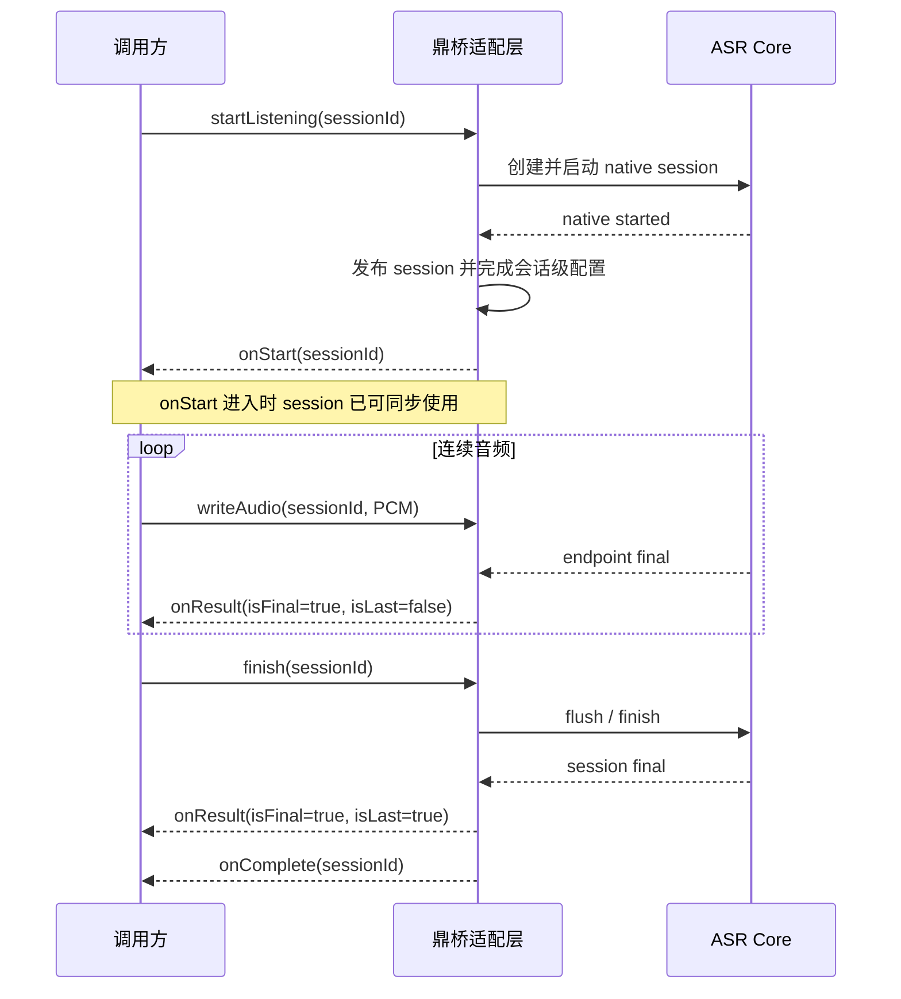
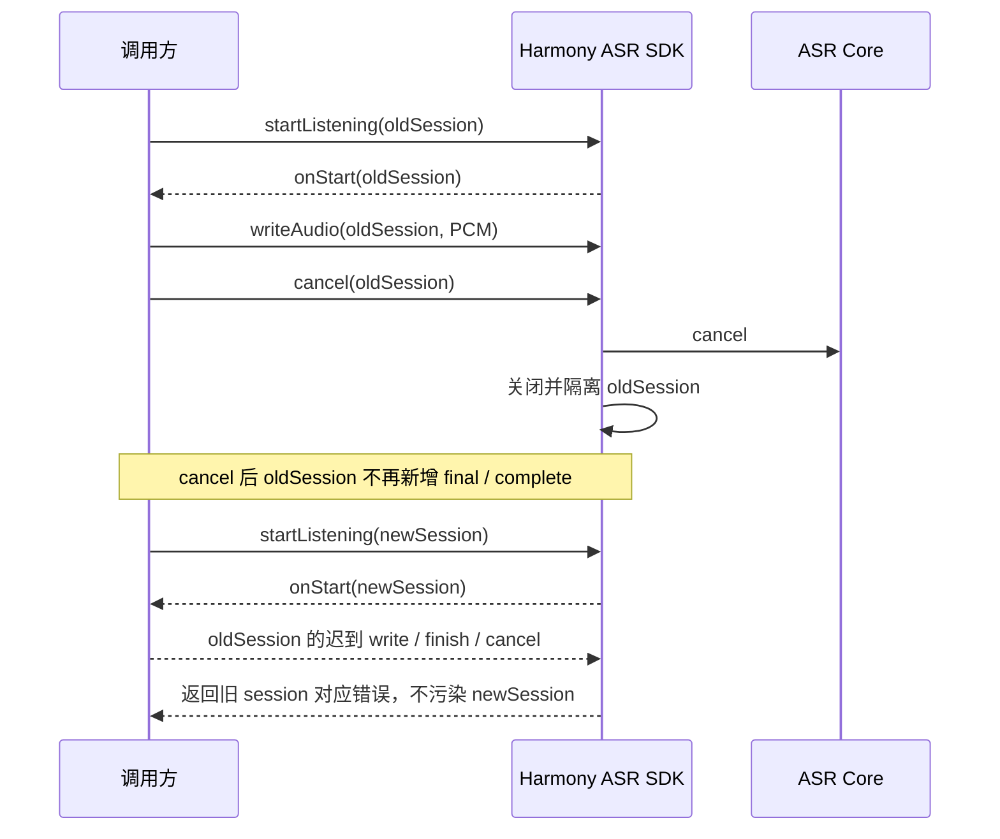
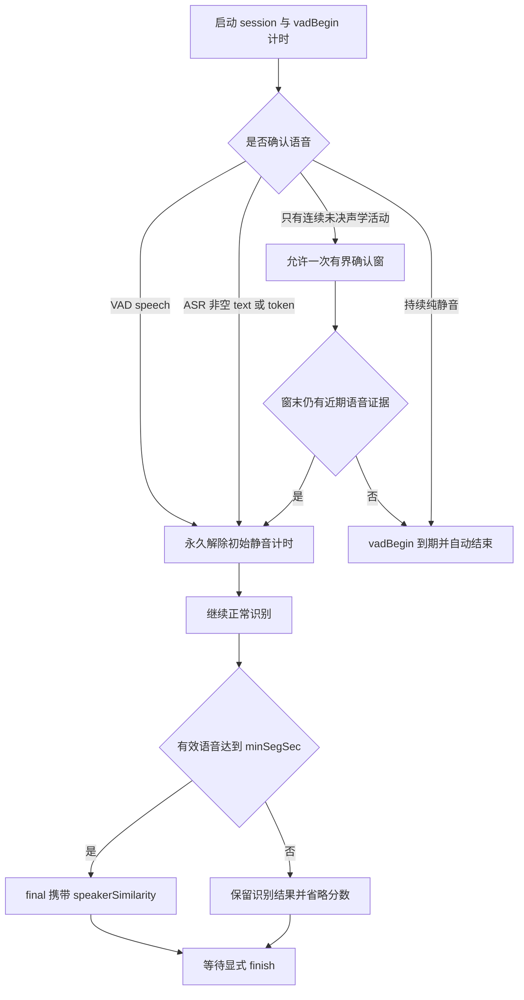

# Harmony ASR 生命周期问题闭环与防回归说明

## 1. 目的与结论

本文汇总历史缺陷记录中的三类问题、根因修复、公共接口契约和发布门禁，作为项目内部的统一验收依据：

1. `vadBegin=1000` 与声纹组合时，真实首句出现 `speakerSimilarity=undefined` 并提前 `isLast=true`。
2. 连续识别过程中，调用方尚未执行 `finish` 就偶发 `isLast=true`。
3. 首次冷加载后，调用方在 `onStart` 内同步写入缓存音频时收到 `1002200010 NOT_LISTENING`。

这些问题已经在状态产生的最内层状态机修复，并分别建立主机单测、Harmony 真机模式和发布检查。验收结论应表述为：

> 已知问题在明确复现条件和约定调用范围内完成闭环，并已建立持续回归门禁。

不得表述为“覆盖所有边界”或“未来绝不复现”。

## 2. 公共生命周期契约

| 场景 | 对外保证 |
| --- | --- |
| `onStart` | 对应 session 已发布且完成会话级配置；回调调用栈内可同步 `writeAudio`、`finish` 或 `cancel` |
| 连续识别 | 显式 `finish` 前不得出现 `isLast=true`，除非命中明确配置的 `vadBegin` 或 `maxAudioDuration` |
| 正常结束 | 每个 session 恰好一次 `isLast=true`，随后恰好一次 `onComplete` |
| endpoint | `isFinal=true` 仅表示一句话结束，不等于整个 session 结束 |
| cancel | cancel 生效后不得新增 final 或 complete；取消前已经产生的 non-last endpoint final 保留 |
| 跨 session 重入 | 所有 native 回调绑定 session generation；回调内 cancel/restart 后，旧处理栈和迟到回调不得读取或结束新 session |
| 最大时长 | 缺省或非法 `maxAudioDuration` 不启用自动上限；仅显式有限值启用并钳制到 20000 到 28800000 ms |
| 声纹分数 | 有效语音达到 `TargetSpeakerConfig.minSegSec` 时 final 应携带 `speakerSimilarity`；不足门槛时可省略分数，但不得丢识别结果 |

## 3. 修复后的正常时序

`onStart` 的实现门禁同时等待 `native started` 和 `session published`。两个事件无论谁先发生，对外都只发送一次 `onStart`。

## 4. cancel 与跨 session 隔离

所有压力用例按 `sessionId` 保存有序回调轨迹。每个 native callback 还携带创建 session 时的
generation；外部监听器返回后，任何终止动作都要再次核对 generation。聚合回调数量相等不能
替代逐 session 归属检查。

## 5. `vadBegin` 与声纹组合决策

声学 backstop 不能把固定高能直接当作 speech。它只允许触发一次确认窗，最终仍需近期语音型能量变化、合理过零率或 ASR 非空 text/token 才能解除初始静音计时。

## 6. 历史问题与防复发机制

| 历史症状 | 根因层 | 修复机制 | 永久门禁 |
| --- | --- | --- | --- |
| 首句无分数并提前 last | 初始静音 deadline 与声纹最短有效语音窗口竞争 | 多信号起音确认；一次有界确认窗；旧活动不能直接解除计时 | `test_harmony_initial_silence_tracker`、`voiceprint-vad-begin`、`voiceprint-vad-begin-idle` |
| 连续识别提前 last / 旧结果污染新 session | 用全局 finish 状态推断较早异步 final；回调未绑定 session generation | 只依据当前结果的 `isLast`；所有回调校验 generation，并在外部监听器返回后复检 | `test_harmony_rejected_final_lifecycle`、`test_harmony_session_callback_generation`、`burst`、`paced`、`user-sequence` |
| 冷加载首次写入失败 | native started 同步回调早于适配层发布 session | started/published 双条件门禁，发布后才发送一次 `onStart` | `test_harmony_session_start_gate`、`start-write`、`start-write-reload` |

## 7. 2026-07-16 验证快照

验证对象为同一 commit、同一中英 `ZH_EN` HAP 和一台 HarmonyOS 6.1 arm64 真机。测试数据为 16 kHz、16-bit、单声道 WAV。生命周期结果不以文本正确率判定 PASS。

| 模式 | cycle |
| --- | ---: |
| `voiceprint-vad-begin` | 4 |
| `speaker-vad-onstart` | 4 |
| `start-write-reload` | 4 |
| `numeric-edge` | 2 |
| `max-duration` | 1 |

汇总结果：

- 15/15 cycle PASS。
- 0 个失败 cycle，0 个意外回调，0 次显式 `finish` 前提前 last。
- 所有正常结束轨迹满足一次 `final-last` 后一次 complete。
- `voiceprint-vad-begin` 的 burst/paced、直接起音/前置静音四种组合各 1 轮；4/4 满足声纹分数契约，4/4 在 `finish` 前 last 数为 0。
- hilog 未命中 `SIGSEGV`、`SIGABRT`、native crash、double free 或 heap corruption 等强崩溃特征。

`0.2.5` 收敛候选构建完成了改动相关的定向复验：声纹首句分数、`vadBegin=1000`、
`onStart` 可用性、冷加载重载、非法/非有限 `maxAudioDuration` 和显式最大时长自动结束均通过。

关键内部 artifact：

| 证明目标 | run ID |
| --- | --- |
| 声纹与 `vadBegin=1000` 四组合 | `20260716-084318-voiceprint-vad-begin-b08b71fa` |
| `onStart` 内启用 Speaker VAD | `20260716-084335-speaker-vad-onstart-879e961d` |
| 冷加载 `onStart` 内同步写入 | `20260716-084357-start-write-reload-85f12115` |
| 非法/非有限数值参数 | `20260716-084405-numeric-edge-42d01c1b` |
| 显式最大时长自动结束 | `20260716-084446-max-duration-b9b853eb` |

每个 run 目录必须保留 `report.json`、`result.txt`、`memory.csv`、`hilog.txt`、`inventory.json` 和输入 payload 映射。

## 8. 资源稳定性

| 场景 | 观察时间 | RSS 净变化 | RSS 斜率 | 线程变化 |
| --- | ---: | ---: | ---: | ---: |
| paced | 313.9 秒 | +6.24 MiB | +1.58 MiB/min | 0 |
| cancel-full | 533.0 秒 | +0.52 MiB | +0.39 MiB/min | 0 |
| reconfigure | 541.9 秒 | +1.26 MiB | +0.30 MiB/min | 0 |
| user-sequence 300 | 437.3 秒 | +5.55 MiB | +1.40 MiB/min | 0 |

短场景的瞬时 RSS 变化可能包含模型逐步驻留，不能单独判定泄漏。资源结论以超过 60 秒的观察和 `shutdown -> unloadModel -> createEngine` 后的可回落性为准。

## 9. 发布与交付要求

1. 合入前运行状态机单测、Harmony 编译和同一构建产物的真机 bug 闭环矩阵。
2. 本次不处理 Android 端，同名生命周期校验见 `docs/asr/ANDROID_LIFECYCLE_PARITY_TODO.md`。
3. 客户材料使用 `docs/customer/ASR_LIFECYCLE_ASSURANCE_20260716.md` 和对应 JSON 摘要，不得复制本文件的内部 artifact ID。
4. 客户包组装时必须通过 `check_customer_delivery_redaction.py`，并由 `BUILD_PROVENANCE.json` 与 `checksum.txt` 绑定实际交付版本。

## 10. 未覆盖边界

当前门禁不替代以下独立验证：

- ASR WER/CER 和声纹目标/非目标相似度精度评测。
- 任意回调内立即取消旧 session 并启动新 session 的极限重入路径；该项已记录为后续强化，不作为本次历史 bug 闭环条件。
- 物理断连、系统强杀、麦克风权限动态撤销、音频路由切换和系统级极端内存压力。
- 其他硬件型号、系统补丁版本及宿主调度器差异。

这些边界应作为外部故障与兼容性矩阵单独报告，不能混入生命周期 PASS 结论。
