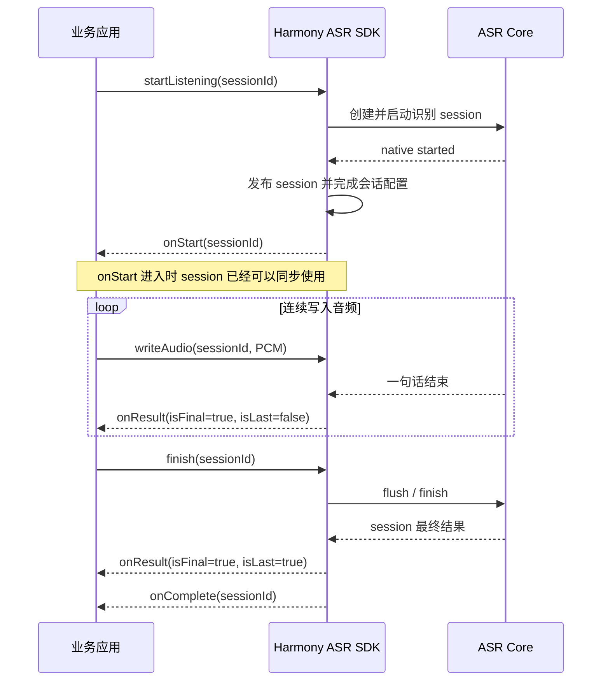
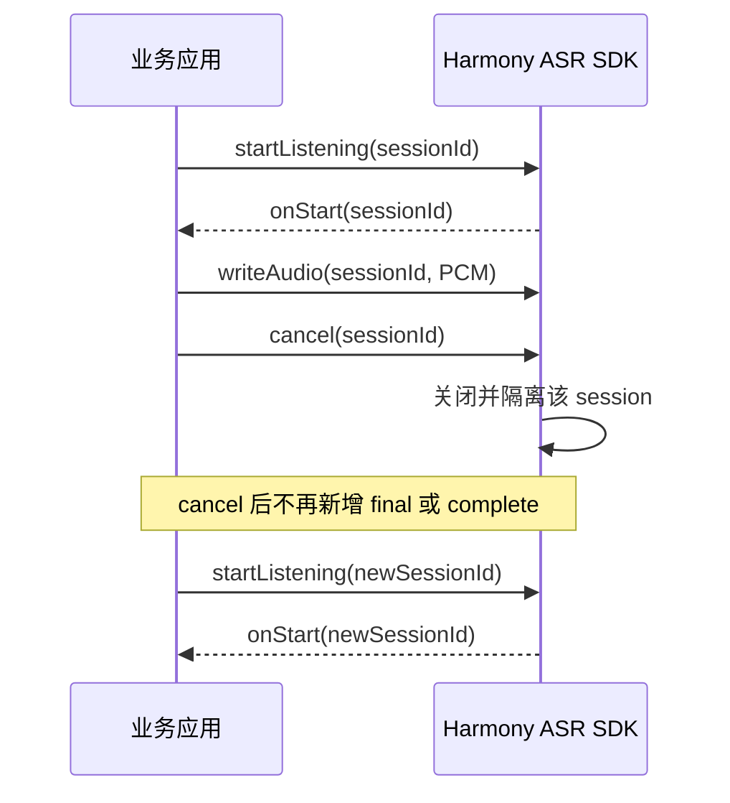

# Harmony 离线 ASR SDK 生命周期问题闭环说明

**报告日期：2026-07-16**

**适用版本：以交付包 `BUILD_PROVENANCE.json` 和 `checksum.txt` 记录为准**

## 1. 结论

针对历史反馈的提前结束、声纹分数缺失及冷加载首次调用失败问题，SDK 已完成根因级修复，并建立自动化与 HarmonyOS 真机回归门禁。

本次共执行 1366 个测试循环、2266 次 session 启动，结果如下：

- 1366/1366 测试循环通过。
- 0 次显式 `finish` 前提前 `isLast=true`。
- 0 次重复结束或跨 session 回调污染。
- 0 个意外回调，未发现 native 崩溃特征。
- 所有正常 session 均为一次 `isLast=true`，随后一次 `onComplete`。
- 所有 cancel session 在取消生效后均未新增 final 或 complete。

在 `0.2.5` 最终候选构建上，另对本次改动直接相关的冷重载、真实业务调用顺序和
`voiceprint + vadBegin=1000` 四组合执行 360 个定向回归循环、960 次 session 启动，
360/360 通过，未出现提前 last、重复结束或跨 session 回调污染。

本结论表示已知问题在明确复现条件和约定调用范围内完成闭环，不代表已经穷举所有外部故障或所有未来运行环境。

## 2. SDK 对外保证

| 场景 | 接口保证 |
| --- | --- |
| `onStart` | 对应 session 已经可用；回调调用栈内可同步调用 `writeAudio`、`finish` 或 `cancel` |
| 连续识别 | 正常情况下，在调用方执行 `finish` 前不会出现 `isLast=true` |
| 自动结束 | 只有明确配置并命中 `vadBegin` 或 `maxAudioDuration` 时，SDK 才允许自动结束 |
| 正常结束 | 恰好一次 `isLast=true`，随后恰好一次 `onComplete` |
| endpoint | `isFinal=true` 表示一句话结束，不表示整个 session 结束 |
| cancel | cancel 生效后不再新增 final 或 complete |
| 声纹分数 | 有效语音达到 `minSegSec` 时返回 `speakerSimilarity`；不足门槛时可以省略分数，但保留识别结果 |

## 3. 正常识别时序

## 4. cancel 时序

## 5. 历史问题闭环

| 历史现象 | 修复后的机制 | 本次验证 |
| --- | --- | --- |
| 声纹首句没有分数并提前结束 | 真实起音永久解除初始静音计时；声纹确认只允许一次有界等待；稳态高能非语音不能直接解除计时 | `vadBegin=1000` 下突发/实时、直接起音/前置静音四种组合共 40 轮通过 |
| 连续识别偶发提前 `isLast` | session 是否完成只依据当前结果自身的 `isLast`，不使用全局结束状态推断较早结果 | 所有测试中显式 `finish` 前提前 last 为 0 |
| 冷加载首次调用返回未监听 | SDK 只在 native 已启动且 session 已发布后发送一次 `onStart` | `onStart` 内同步 write/finish 100 轮、每轮冷卸载重载 20 轮通过 |
| cancel 后出现尾回调 | cancel 后立即隔离 session，并按 sessionId 拒绝迟到调用 | cancel 相关测试 250 轮通过 |
| 旧 session 影响新 session | 所有结果和公共 API 按 sessionId 校验归属 | 复合业务调用顺序 400 轮通过 |

声纹与 `vadBegin=1000` 的四种组合各执行 10 轮。40/40 在显式 `finish` 前没有 last，40/40 的首个非空 final 携带 `speakerSimilarity`。

## 6. 测试矩阵

| 测试组 | 覆盖内容 | cycle |
| --- | --- | ---: |
| 标准输入 | 缓存突发写入、20 ms 实时写入 | 6 |
| VAD 与自动结束 | 真实语音、纯静音、最大音频时长 | 120 |
| 声纹 | 门槛上下、低音量、前置静音、多句、初始等待组合 | 100 |
| 取消与重建 | 半途取消、完整输入后取消、引擎重建和重配 | 220 |
| 非法与边界调用 | 非法 session/frame、重复 finish、非有限数参数 | 200 |
| 回调重入 | 回调内重启、`onStart` 内 cancel/write/finish | 300 |
| 冷加载 | 每轮 `shutdown -> unloadModel -> createEngine` | 20 |
| 真实业务顺序 | 快速取消/重启、finish 后立即下一 session、旧 session 迟到调用 | 400 |

测试输入为 16 kHz、16-bit、单声道 PCM，按短、中、长音频分层选择。语料来源、文件名、设备型号和设备标识均已脱敏。

## 7. 长时间资源观察

| 场景 | 观察时间 | RSS 净变化 | 线程变化 |
| --- | ---: | ---: | ---: |
| 20 ms 实时写入 | 313.9 秒 | +6.24 MiB | 0 |
| 完整输入后取消 | 533.0 秒 | +0.52 MiB | 0 |
| 会话级参数重配 | 541.9 秒 | +1.26 MiB | 0 |
| 300 轮真实业务顺序 | 437.3 秒 | +5.55 MiB | 0 |

上述长时间场景均未触发 RSS 或线程增长门槛。短场景中的瞬时内存变化可能包含模型按需驻留，因此不单独作为内存泄漏结论。

## 8. 测试环境与脱敏说明

| 项目 | 说明 |
| --- | --- |
| 平台 | HarmonyOS 6.1 arm64 真机 |
| 设备数量 | 1 |
| 设备型号与标识 | 已脱敏 |
| SDK/HAR 版本身份 | 以交付包 `BUILD_PROVENANCE.json` 为准；Demo HAP checksum 还会随授权和签名变化 |
| 产物完整性 | 以交付包 `checksum.txt` 为准 |
| 测试语料标识 | 已脱敏；内部报告保留可追溯映射 |
| 授权信息 | 不进入本报告 |

本报告不包含设备序列号、ODID、用户目录、内部仓库路径、原始语料文件名、内部测试 run ID、license ID 或私钥信息。

## 9. 结论边界

本报告验证 SDK 生命周期、回调顺序、session 归属、错误码、资源回收和失败后的可恢复性。以下内容需要使用独立测试集或专项环境验证：

- ASR 字错率和声纹目标/非目标相似度精度。
- 物理断连、系统强杀、麦克风权限动态撤销和音频路由切换。
- 其他硬件型号、系统补丁和宿主调度环境。

因此，对外推荐表述为：

> 历史反馈的生命周期问题已在对应复现条件下完成根因修复，并通过自动化与 HarmonyOS 真机回归；相同门禁已纳入后续版本交付流程。
