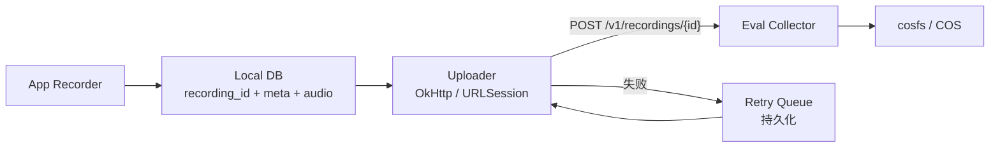

# Amphion Eval Collector 客户端接入指南

本文档面向 app 工程师（Android / iOS），说明如何把单条录音上传到本服务。协议契约见 [../server_spec.md](../server_spec.md)，本文档不重复 NORMATIVE 内容，只覆盖"我怎么用"。

> Android 评测客户端的参考实现已经独立成 `:samples:internal-eval` 模块（applicationId `com.amphion.asr.sample.eval`），与对外 demo `:samples:public-demo` 物理隔离。本文档示例代码与仓库内位置请参照 §4 末尾。

## 1. 总览



一句话：每条录音生成 UUIDv4 作为 `recording_id`，本地持久化，作为 multipart PUT 到服务端，按 `body.code` 决定永久失败 / 重试。

## 2. 服务地址

当前阶段单环境部署：

环境, base URL, 备注:
- 当前, https://testdata.amphion.top, 评估收集服务（HTTPS，TLS 1.3，Let's Encrypt 证书）

后续如分出 staging / prod，会新增 amphion.top 二级域名，同步更新本节。

健康检查端点：`GET /v1/health`，5 秒超时。可作为"网络是否到达服务"的探针，与上传链路解耦：

```bash
curl -sf https://testdata.amphion.top/v1/health
# {"status":"ok","now":"2026-05-19T..."}
```

注意事项：
- HTTP 请求会被 301 重定向到 HTTPS，OkHttp / URLSession 默认会跟随。如显式禁用 follow-redirect 必须手动用 https
- 服务端落盘单条耗时约 6 秒（cosfs 写延迟）。客户端 read timeout 至少 30 秒，避免假性 5xx

## 3. 鉴权

服务端支持两种 token 模式（spec 1.2 都合法），**当前部署采用共享 token 模式**。

### 3.1 共享 token（当前模式）

全员共用一个 hex24 token。app 端只需要保存这一个串。

- 服务端**不校验** token 与 meta.tester_id 的对应——任何 meta.tester_id 都接受
- 落盘路径与服务端限速按 meta.tester_id 区分（app 端自报）
- 安全代价：token 泄露所有人受影响；身份无法服务端核验

存储要求（任何模式都适用）：

- Android：`EncryptedSharedPreferences`（androidx.security.crypto）
- iOS：Keychain（kSecClassGenericPassword + kSecAttrAccessibleAfterFirstUnlock）
- 严禁：硬编码到 apk / ipa；写到普通 SharedPreferences / NSUserDefaults

### 3.2 per-tester token（备选）

若服务端切到 per-tester 模式（每条 token 绑定一个 tester），meta.tester_id 必须与 token 绑定 tester 一致，否则返回 403 FORBIDDEN。app 端的代码与共享模式完全相同（仍然只持有一个 token），区别只在于运维侧每个 tester 拿到不同的串。

### 3.3 请求头（两种模式相同）

```text
Authorization: Bearer <token>
X-Amphion-Schema-Version: 1
```

### 3.4 错误响应

| 情形 | HTTP | body.code | 客户端处理 |
| --- | --- | --- | --- |
| 缺 / 格式错 / 无效 token | 401 | UNAUTHORIZED | 永久失败，提示用户重新登录或联系运维 |
| token 与 meta.tester_id 不匹配（仅 per-tester 模式） | 403 | FORBIDDEN | 永久失败，本地数据多半是别人的，弃录或人工排查 |

## 4. Android Kotlin 完整示例（OkHttp）

```kotlin
package com.amphion.asr.sample.eval.upload

import okhttp3.*
import okhttp3.MediaType.Companion.toMediaType
import okhttp3.RequestBody.Companion.asRequestBody
import okhttp3.RequestBody.Companion.toRequestBody
import org.json.JSONObject
import java.io.File
import java.util.concurrent.TimeUnit

data class UploadResult(
    val httpStatus: Int,
    val code: String?,         // body.code, null when success
    val statusName: String?,   // "stored" | "duplicate"
    val rawBody: String,
)

class HttpUploader(
    private val baseUrl: String,
    private val tokenProvider: () -> String,
) {
    private val client = OkHttpClient.Builder()
        .connectTimeout(10, TimeUnit.SECONDS)
        .writeTimeout(120, TimeUnit.SECONDS)
        .readTimeout(60, TimeUnit.SECONDS)
        .retryOnConnectionFailure(false)
        .build()

    fun upload(
        recordingId: String,
        metaJson: ByteArray,
        audioFile: File,
        hypothesis: String? = null,
    ): UploadResult {
        val multipart = MultipartBody.Builder()
            .setType(MultipartBody.FORM)
            .addFormDataPart(
                "meta", "meta.json",
                metaJson.toRequestBody("application/json".toMediaType()),
            )
            .addFormDataPart(
                "audio", "audio.wav",
                audioFile.asRequestBody("audio/wav".toMediaType()),
            )
            .apply {
                hypothesis?.let {
                    addFormDataPart(
                        "hypothesis", "hypothesis.txt",
                        it.toByteArray(Charsets.UTF_8)
                            .toRequestBody("text/plain".toMediaType()),
                    )
                }
            }
            .build()

        val req = Request.Builder()
            .url("$baseUrl/v1/recordings/$recordingId")
            .header("Authorization", "Bearer ${tokenProvider()}")
            .header("X-Amphion-Schema-Version", "1")
            .post(multipart)
            .build()

        client.newCall(req).execute().use { resp ->
            val body = resp.body?.string().orEmpty()
            val httpStatus = resp.code
            val (code, statusName) = parseResponse(httpStatus, body)
            return UploadResult(httpStatus, code, statusName, body)
        }
    }

    private fun parseResponse(http: Int, body: String): Pair<String?, String?> {
        if (body.isEmpty()) return null to null
        return try {
            val json = JSONObject(body)
            val code = json.optString("code", "").ifEmpty { null }
            val statusName = json.optString("status", "").ifEmpty { null }
            code to statusName
        } catch (_: Exception) {
            null to null
        }
    }
}
```

调用方：

```kotlin
val uploader = HttpUploader(
    baseUrl = "https://testdata.amphion.top",
    tokenProvider = { secureStore.bearerToken() },
)

val result = uploader.upload(
    recordingId = recording.id,
    metaJson = recording.metaBytes,    // 关键：原字节回传，不要重新序列化
    audioFile = recording.audioFile,
    hypothesis = recording.onDeviceHypothesis,
)

when {
    result.statusName == "stored" -> markUploaded(recording.id)
    result.statusName == "duplicate" -> markUploaded(recording.id)
    isPermanent(result.code, result.httpStatus) -> markPermanentlyFailed(recording.id, result.code)
    else -> enqueueRetry(recording.id)
}
```

对应仓库内的客户端实现：[asr/android/samples/internal-eval/.../HttpUploader.kt](../../asr/android/samples/internal-eval/src/main/java/com/amphion/asr/sample/eval/upload/HttpUploader.kt)（参见 server_spec 第五节）。

> 历史路径 `asr/android/samples/public-demo/...` 在 0.2.0 已废弃：评测代码搬到 `:samples:internal-eval` 模块后，`:samples:public-demo` 只承载通用演示流程。已克隆仓库的人请刷新到 main 后跑 `./gradlew :samples:internal-eval:installDebug`。这里的 `eval` 是 evaluation（评测）的缩写。

## 5. iOS Swift 骨架（占位，未经验证）

iOS 端尚未投入生产验证，下面是用 URLSession 实现的最小骨架，欢迎 iOS 工程师补充：

```swift
import Foundation

enum UploadOutcome {
    case stored
    case duplicate
    case permanent(code: String)
    case retryable(code: String?)
}

final class HttpUploader {
    let baseUrl: URL
    let tokenProvider: () -> String

    init(baseUrl: URL, tokenProvider: @escaping () -> String) {
        self.baseUrl = baseUrl
        self.tokenProvider = tokenProvider
    }

    func upload(recordingId: String,
                metaJson: Data,
                audioUrl: URL,
                hypothesis: String?) async throws -> UploadOutcome {
        let boundary = "Boundary-\(UUID().uuidString)"
        var req = URLRequest(url: baseUrl.appendingPathComponent("/v1/recordings/\(recordingId)"))
        req.httpMethod = "POST"
        req.setValue("Bearer \(tokenProvider())", forHTTPHeaderField: "Authorization")
        req.setValue("1", forHTTPHeaderField: "X-Amphion-Schema-Version")
        req.setValue("multipart/form-data; boundary=\(boundary)", forHTTPHeaderField: "Content-Type")

        var body = Data()
        body.append(part(boundary: boundary, name: "meta", filename: "meta.json",
                         contentType: "application/json", payload: metaJson))
        let audioData = try Data(contentsOf: audioUrl)
        body.append(part(boundary: boundary, name: "audio", filename: "audio.wav",
                         contentType: "audio/wav", payload: audioData))
        if let h = hypothesis, let hData = h.data(using: .utf8) {
            body.append(part(boundary: boundary, name: "hypothesis", filename: "hypothesis.txt",
                             contentType: "text/plain", payload: hData))
        }
        body.append("--\(boundary)--\r\n".data(using: .utf8)!)

        let (data, response) = try await URLSession.shared.upload(for: req, from: body)
        guard let http = response as? HTTPURLResponse else { return .retryable(code: nil) }
        let json = try? JSONSerialization.jsonObject(with: data) as? [String: Any]
        let code = json?["code"] as? String
        let statusName = json?["status"] as? String

        switch (http.statusCode, statusName, code) {
        case (200, "stored", _): return .stored
        case (200, "duplicate", _): return .duplicate
        case (400, _, let c?), (401, _, let c?), (403, _, let c?),
             (413, _, let c?), (415, _, let c?):
            return .permanent(code: c)
        default: return .retryable(code: code)
        }
    }

    private func part(boundary: String, name: String, filename: String,
                      contentType: String, payload: Data) -> Data {
        var d = Data()
        d.append("--\(boundary)\r\n".data(using: .utf8)!)
        d.append("Content-Disposition: form-data; name=\"\(name)\"; filename=\"\(filename)\"\r\n".data(using: .utf8)!)
        d.append("Content-Type: \(contentType)\r\n\r\n".data(using: .utf8)!)
        d.append(payload)
        d.append("\r\n".data(using: .utf8)!)
        return d
    }
}
```

## 6. 客户端幂等与重试

### 6.1 recording_id 持久化

录音落盘那一刻就生成 `UUID.randomUUID().toString()` 写入本地 DB；上传失败的所有后续重传必须用同一 id。这是 spec 1.4 幂等性的客户端前提：服务端按 id 判定是否重复。

### 6.2 重试判定（按 body.code 而非 HTTP code）

| body.code | 含义 | 处理 |
| --- | --- | --- |
| (无, status=stored) | 首次成功 | 标记已上传 |
| (无, status=duplicate) | 重复，服务端已有 | 标记已上传 |
| SCHEMA_MISMATCH | 协议不兼容 | 永久失败，需要 app 升级 |
| INVALID_AUDIO | 音频格式不对 | 永久失败，本地检查录音参数 |
| RECORDING_ID_MISMATCH | URL 与 meta 不一致 | 永久失败，本地 bug |
| UNAUTHORIZED | token 无效 | 永久失败，重新登录 |
| FORBIDDEN | token 与 tester 不匹配 | 永久失败，多半是数据错乱 |
| PAYLOAD_TOO_LARGE | 音频超过 25MB | 永久失败，截断或丢弃 |
| UNSUPPORTED_MEDIA_TYPE | content-type 错 | 永久失败，本地 bug |
| RATE_LIMITED | 速率超限 | 重试（按 5xx 退避） |
| STORAGE_FULL | 服务端磁盘满 | 重试 |
| 任何 5xx 或网络异常 | 临时失败 | 重试 |

简化判定：HTTP 4xx 且 body.code 在永久列表 → 永久失败；其它一切 → 重试。

### 6.3 退避参数（建议）

```text
base = 2 秒
factor = 2
max = 5 分钟
jitter = ±20%
```

`delay = min(max, base * factor^attempt) * (1 + uniform(-0.2, 0.2))`

### 6.4 应用重启

retry 队列必须本地持久化（SQLite / Realm / Room）。仅放内存的队列在 app 被杀后会丢失，spec 1.4 不变量"录音不丢"在客户端侧由这条保证。

### 6.5 单 tester 速率自我节流

服务端默认 1 req/s burst 3。app 端如果短时连续录了 10 条要上传，建议本地也加同样的 token bucket，避免拿 429 走重试浪费一轮。

## 7. multipart 字段约束（容易踩坑）

字段, 必选, content-type, 约束:
- meta, 是, application/json, 字节级原样回传（见下）
- audio, 是, audio/wav, 16kHz / mono / 16-bit PCM
- hypothesis, 否, text/plain, UTF-8

特别注意 meta：

- 不要为了"美化"而 JSON.parse 后 JSON.stringify。服务端把 meta.json 字节级落盘，重新序列化会改字段顺序、空格、Unicode 转义形态，虽然 server 不校验字节相等，但 NORMATIVE 1.8 #3 要求"不污染原 meta"
- meta.recording_id 必须等于 URL 里的 recording_id（spec 1.6 RECORDING_ID_MISMATCH）
- meta.schema_version 必须等于 X-Amphion-Schema-Version 头（spec 1.6 SCHEMA_MISMATCH）
- meta.tester_id 必须与 token 关联的 tester 一致（spec 1.6 FORBIDDEN）
- 完整 schema 见 docs/eval/SCHEMA.md（Amphion 主仓内）

## 8. 端到端调试 checklist

### 8.1 三条 curl 冒烟（替换 BASE 与 TOKEN 后跑）

```bash
BASE=https://testdata.amphion.top
TOKEN=<your bearer token>

# 1) 健康检查
curl -sf $BASE/v1/health
# 期望 {"status":"ok",...}

# 2) 上传一条录音（需 ffmpeg 准备 WAV）
RID=$(uuidgen | tr A-Z a-z)
ffmpeg -hide_banner -loglevel error -y -f lavfi -i "anullsrc=cl=mono:r=16000" \
  -ac 1 -ar 16000 -t 1 -c:a pcm_s16le /tmp/audio.wav
cat > /tmp/meta.json <<EOF
{
  "schema_version": 1,
  "finalized": true,
  "recording_id": "$RID",
  "attempt_index": 1,
  "sentence_id": "smoke_001",
  "category_id": "smoke",
  "reference_text": "test",
  "tester_id": "alice",
  "tester_nickname": "Alice",
  "device": {"model":"x","manufacturer":"y","android_sdk":34,"abi":"arm64-v8a"},
  "app_version": "0.1.0", "sdk_version": "0.1.0",
  "model_id": null, "model_version": null,
  "recorded_at": "2026-05-19T10:47:00Z",
  "duration_ms": 1000, "sample_rate": 16000, "gain_db": 0.0,
  "audio_source": "VOICE_RECOGNITION",
  "env": {"location":"","noise_level":"low","noise_level_db_estimate":null,"notes":""},
  "on_device_hypothesis": null, "on_device_wer_estimate": null,
  "upload": {"state":"pending","uploaded_at":null,"attempts":0,"last_error":null,"last_attempt_at":null,"server_url":null}
}
EOF
curl -sv \
  -H "Authorization: Bearer $TOKEN" \
  -H "X-Amphion-Schema-Version: 1" \
  -F "meta=@/tmp/meta.json;type=application/json" \
  -F "audio=@/tmp/audio.wav;type=audio/wav" \
  $BASE/v1/recordings/$RID
# 期望 {"status":"stored",...}

# 3) 幂等
curl -s \
  -H "Authorization: Bearer $TOKEN" \
  -H "X-Amphion-Schema-Version: 1" \
  -F "meta=@/tmp/meta.json;type=application/json" \
  -F "audio=@/tmp/audio.wav;type=audio/wav" \
  $BASE/v1/recordings/$RID
# 期望 {"status":"duplicate",...}
```

### 8.2 抓包对比

- Android：开发机用 Charles / Proxyman，安装根证书后看 multipart body 是否与 curl 字节相同
- iOS：mitmproxy + 系统级证书信任

对比要点：boundary、Content-Disposition 头、字段顺序（meta / audio / hypothesis）

### 8.3 错误根因表

HTTP 状态, body.code, 最常见根因, 排查动作:
- 401, UNAUTHORIZED, token 拼写错 / 头缺 Bearer 前缀, curl 复现，检查 secure store 取出值
- 403, FORBIDDEN, meta.tester_id 与 token 关联的不一致, 找运维确认 token 归属
- 400, SCHEMA_MISMATCH, meta.schema_version 与 X-Amphion-Schema-Version 不等 / json 不合法, 打日志看上传前的 meta bytes
- 400, RECORDING_ID_MISMATCH, URL 路径与 body 里的 recording_id 用了两个不同变量, 一个变量贯穿，避免重新生成
- 400, INVALID_AUDIO, WAV 不是 16kHz mono 16-bit, 检查录音管线参数：AudioRecord MIC + 16000 Hz + ENCODING_PCM_16BIT
- 413, PAYLOAD_TOO_LARGE, 录音超过 25MB（约 13 分钟）, 限制单条录音时长
- 415, UNSUPPORTED_MEDIA_TYPE, audio part 没带 content-type 或带了 image/png 之类, 检查 multipart 构造代码
- 429, RATE_LIMITED, 单 tester 短时连发太多, 客户端加自我节流
- 5xx, 任意, 服务端异常, 重试，看 Sentry / 服务端日志

## 9. FAQ

**Q: 服务端返回 200 stored，但我立刻 ssh 去 cosfs ls 看不到文件？**

A: cosfs 元数据有秒级延迟，几秒后会出现。`stored` 已意味着字节进入 COS 持久化层，app 端不需关心可见性延迟。

**Q: 同一 recording_id 第二次上传，为什么返回 duplicate 而不是 409？**

A: spec 1.4 显式要求 200 duplicate（不是 409）。如果客户端拿到 4xx 当永久失败，会卡死用户重试链路。

**Q: 我能同时上传 100 条吗？**

A: 服务端建议 1 req/s per tester，超出会 429。app 端必须串行或自我限速；retry 队列里的任务也要受同一限速器约束。

**Q: 测试期间 token 可以多人共享吗？**

A: 不推荐。运维侧对 token 与 tester 一一映射；多人共享一个 token 会让 spec 1.2 的 tester 校验失效，并且 403 错误码失去意义。

**Q: 网络断开时 OkHttp 已经写了一半，怎么办？**

A: OkHttp 抛 IOException，服务端可能已写入也可能没写。客户端无脑用同一 recording_id 重传，幂等机制保证至多一份落盘。

**Q: 我能调用 GET /v1/recordings/{id} 看自己上传过哪些吗？**

A: 当前不支持读取，只支持 POST 写入。后续如有需要，会在 spec 添加新端点并 bump 版本。

## 10. 与 server_spec.md 的关系

| 本文档章节 | spec 对应小节 |
| --- | --- |
| 2 服务地址 | 1.1 端点 |
| 3 鉴权 | 1.2 鉴权 |
| 4-5 客户端示例 | 1.3 请求体 + 1.5 响应 |
| 6 重试 | 1.4 幂等性 + 1.6 错误码 |
| 7 multipart 约束 | 1.3 请求体 + 1.6 |
| 8.1 curl 冒烟 | 第三章 CONFORMANCE 3.1-3.6 |

任何一项规则与 spec 不一致时以 spec 为准。本文档变更前先确认 spec 是否变更；spec 变更时本文档必须同步 bump。
