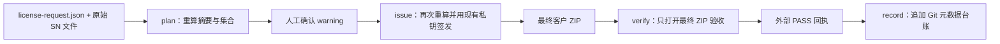

# 密钥与 SDK 固定约束下的 License 交付机制 v1

## 1. 目标与边界

本机制把正式商用离线 License 交付收敛为一条可复核链路：显式申请、原始输入摘要、SN 规范化、风险确认、现有私钥签发、最终 ZIP 独立验收和 Git 元数据登记。

v1 的硬约束：

- 不更换私钥、私钥位置、ECDSA P-256 签名算法、SDK 内置公钥、盐值或 SN 哈希规则。
- 不修改 Android/HarmonyOS ASR/TTS SDK，不实现设备端 `licenseGeneration` 防回退。
- 正式商用流程必须绑定设备；demo/eval 的无设备绑定授权继续使用原脚本。
- 单人可以完成全流程，但计划、warning 确认、各阶段操作者和产物摘要必须留痕。
- License 私钥只签 License，不签交付 attestation。v1 依赖 checksum、独立验收回执和 Git 历史，并明确保留“有仓库管理权限者可以改写记录”的风险。

因此，本机制是当前固定约束下的工程治理基线，不宣称达到带 HSM/KMS、双人控制、签名 attestation、WORM 审计和设备端防回退的最高等级实践。

## 2. 统一流程

正式入口是 `tools/license/license_delivery.py`：



四个命令的状态边界：

| 命令 | 输入 | 输出 | 私钥访问 |
| --- | --- | --- | --- |
| `plan` | 申请 JSON、当前完整 SN 输入、可选上一版完整输入 | 不含明文 SN 的计划回执 | 否 |
| `issue` | 原始输入、已确认计划、warning 确认 | 客户 ZIP、签发回执 | 是 |
| `verify` | 最终 ZIP、原始输入、计划、四端公钥 | ZIP 外验收回执 | 否 |
| `record` | PASS 验收回执、签发回执、计划回执、最终 ZIP | Git 元数据记录 | 否 |

`issue` 和 `verify` 都重新读取原始输入，不使用计划阶段留下的临时明文清单。请求、源文件、SN 集合、warning 或上一版差分任一项变化都会阻断。

## 3. 申请契约

申请文件为 UTF-8 `license-request.json`，示例见 `tools/license/license-request.example.json`。必填内容：

- `requestId`：一次申请的唯一标识。
- `licenseId`：一次不可变签发的唯一标识。
- `deliveryId`：一次交付动作的唯一标识，同时决定 ZIP 和包内根目录名称。
- `customerId`、`projectId`、`reason`、`issuedAt`。
- 每个源文件的基名、SHA-256、工作表和明确 SN 列名。
- `policy.features`、`policy.sdkMajor`、可选 `policy.installTier`。
- `policy.applicationRecord.mode`：`none` 或 `record-only`。当前 SDK 不按包名限制。
- `policy.certificateBinding.mode`：`none` 或 `sha256`。
- `policy.runtimeExpiry`：`perpetual` 或明确日期。
- `policy.maintenance`：`unlimited` 或明确日期。
- `policy.deviceBinding=required`。
- 可选 `previousLicenseId`；非空时必须提供上一版完整申请和完整 SN 输入。

空字符串不能替代显式的永久或无限策略。`issuedAt` 不能是未来日期；明确到期日和维护期不能早于 `issuedAt`。

所有源文件名只允许基名，禁止绝对路径和目录穿越。源文件和申请回执属于安全域材料，不进入 Git 台账或客户 ZIP。

## 4. Excel、CSV、TXT 与 SN 规则

### 4.1 输入格式

- 支持 `.xlsx`、UTF-8 `.csv` 和 UTF-8 `.txt`。
- 拒绝 `.xlsm`、旧 `.xls`、宏工作簿和其他未声明格式。
- `.xlsx` 使用固定版本 `openpyxl==3.1.5`，以保留单元格类型证据。
- Excel SN 单元格必须是文本；数字、日期、公式、布尔和错误值直接阻断。
- 缺失/重复表头、缺失工作表或列、合并单元格、非法字符直接阻断。
- CSV 必须有唯一明确表头；TXT 固定一行一个 SN，可含空行和以 `#` 开头的注释。

隐藏行仍计入集合，隐藏列若被明确选中也计入集合；二者产生 warning，避免“界面不可见”被误当作“不参与授权”。

### 4.2 规范化

规则与 SDK 当前行为保持一致：

1. 按文本读取；
2. 去除首尾空白；
3. 转为大写；
4. 仅允许 `[A-Z0-9]+`；
5. 不补零、不删除内部字符、不替换 `0/O`、`1/I` 等相似字符；
6. 按规范化值排序、去重后签发。

计划在安全域内保存 `snSetDigest`，用于证明签发输入未变。Git 台账只保存随机 `snSetId` 和唯一设备数量，不保存集合摘要；相同集合再次申请也会得到新的随机 `snSetId`。

### 4.3 warning

以下情况不自动修改数据，而是产生必须显式确认的 warning：

| code | 含义 |
| --- | --- |
| `DUPLICATE_SN` | 规范化后存在重复单元格，最终仅签发一次 |
| `SN_LENGTH_OUTLIER` | 唯一 SN 长度偏离众数 |
| `HIDDEN_ROWS` | 被选工作表存在包含在集合中的隐藏行 |
| `HIDDEN_COLUMNS` | 被选 SN 列处于隐藏状态 |

`issue --acknowledge <code>` 必须覆盖计划中的全部 warning；未知 code 也会被拒绝。确认行为、操作者和 warning code 写入签发回执。

## 5. 完整快照与差分

每次正式 License 都使用完整 SN 快照。增量文件不能直接形成增量 License。

存在 `previousLicenseId` 时，`plan`、`issue` 和 `verify` 都必须重新读取上一版完整申请与完整输入，并输出或复核：

- `added`：当前有、上一版没有；
- `removed`：上一版有、当前没有；
- `unchanged`：两版共有；
- `baseLicenseId`：必须等于申请中的 `previousLicenseId`。

差分只保存数量，不把明细写入非安全域。台账中的 `previousLicenseId` 只表示管理关系；离线现场仍可重新安装旧 License。

## 6. 签发门禁

`issue` 在读取私钥前必须确认：

1. 请求 schema、显式策略和日期合法；
2. 当前及可选上一版源文件摘要与计划一致；
3. SN 集合、统计、warning 和差分与计划一致；
4. 所有 warning 已由命令行显式确认；
5. 唯一 SN 数量大于零；
6. 正在执行的脚本就是当前仓库已跟踪的工具副本，Git 工作区干净，并能记录当前工具 commit；
7. `.secure/amphion-license-private.pem` 是 ECDSA P-256 私钥；
8. 该私钥推导出的公钥与 Android ASR/TTS、HarmonyOS ASR/TTS 四端内置公钥完全一致。

`--allow-dirty` 仅用于排查：产物和回执固定标记 `production=false`，不能进入台账。

底层签发仍使用 `issue_license.py` 中的共享函数，并保持原命令兼容。旧入口不具备上述正式交付门禁。

## 7. 客户 ZIP 与最终验收

ZIP 固定命名为 `<deliveryId>.zip`，包内只有一个同名根目录和六个文件：

```text
<deliveryId>/
├── amphion-license.lic
├── README.md
├── LICENSE_MANIFEST.json
├── LICENSE_VERIFICATION.json
├── LICENSE_VERIFICATION.md
└── SHA256SUMS.txt
```

包内报告说明源文件数量、非空记录、唯一 SN、重复项、长度分布和授权策略，但不包含：

- 明文 SN 或设备哈希全集的额外副本；
- Excel/CSV/TXT 原始输入；
- PEM、私钥路径或本机绝对路径；
- 计划和签发回执中的安全域摘要。

`verify` 不信任签发阶段的内存结果，只重新打开最终 ZIP，并验证：

- ZIP CRC、路径安全、非符号链接和固定文件集；
- `SHA256SUMS.txt` 与每个成员精确一致；
- 包内没有明文 SN、PEM 或本机绝对路径；
- ECDSA P-256 签名能由四端一致公钥验证；
- claims 与申请中的 ASR/TTS、SDK 主版本、日期和绑定策略一致；
- `authorizedDeviceHashes` 唯一，且与重新读取的 SN 集合精确一致；
- License、manifest、计划和最终 ZIP 身份一致。

验收在 ZIP 外生成 `<zip>.verification.json` 和 `<zip>.verification.md`，其中记录最终 ZIP SHA-256，避免 ZIP 摘要自引用。

## 8. Git 元数据台账

台账文件是 `delivery/license-delivery-history.json`。`record` 只接受：

- 最终验收为 `PASS`；
- 签发、manifest 和验收均为 `production=true`；
- ZIP 文件名、大小、SHA-256、License SHA-256、计划摘要和身份字段完全一致；
- `requestId`、`licenseId`、`deliveryId` 均未登记；
- 当前 Git 工作区干净。

每条记录保存：

- request/license/delivery ID、客户和项目 ID；
- `previousLicenseId`、随机 `snSetId`、唯一设备数量和授权策略；
- License、ZIP、计划、签发回执和验收回执摘要；
- ZIP 文件名和大小、工具 commit、三个阶段操作者、交付日期；
- `status=delivered`。

台账不保存源文件名、源文件摘要、`snSetDigest`、明文 SN、设备哈希或正式 License。工具使用文件锁和原子替换降低并发写入及半写文件风险；逻辑追加不能替代受保护分支或不可变存储。

登记成功后必须把台账修改提交到 Git。计划、签发回执、验收回执和正式 ZIP 不进入 Git，应进入组织批准的受控制品存储。

## 9. 验证与金丝雀

自动测试使用临时 P-256 密钥，不访问生产私钥，覆盖：

- Excel 类型、列/工作表、隐藏数据、重复和长度离群；
- CSV/TXT、规范化、跨文件去重和完整快照差分；
- 输入变化、计划改写、warning 未确认、未来签发日期和空集合；
- 错误曲线、四端公钥不一致、脏工作区非生产标记；
- 固定 ZIP 文件集、checksum、签名、claims、精确设备集合和明文 SN 夹带；
- PASS/production 台账门禁、摘要一致性和重复 ID。

私有金丝雀只在安全域读取真实 Excel，预期为 26,804 个非空单元格、26,769 个唯一 SN、35 个重复单元格和 1 个长度离群项。真实输入、计划回执和生成产物不进入 Git。

本次不修改 SDK，所以不重复 ASR/TTS 真机回归；必须检查四端内置公钥一致性和离线验签契约。

## 10. 剩余风险

- 私钥文件、存放环境和 SDK 信任锚保持现状；v1 不能解决密钥泄露、轮换和恢复。
- 单人签发与 Git 审计不等于双人控制、组织身份签名或 WORM 审计。
- checksum 与 Git 历史不是不可否认的交付证明；有相应权限的管理员仍可共同改写产物与记录。
- `superseded` 或 `revoked` 管理状态不会让离线现场旧 License 自动失效。
- 永久 License 且无可信在线通道时，不能承诺即时吊销。
- 完整快照避免增量基线歧义，但会增加大批量签发的文件体积和处理成本。

更高等级控制及其标准依据见 [`license-delivery-industry-practices.md`](license-delivery-industry-practices.md)。其中的密钥轮换、签名 attestation、职责强制分离和设备端防回退是已知改进方向，不属于 v1 实现范围。
