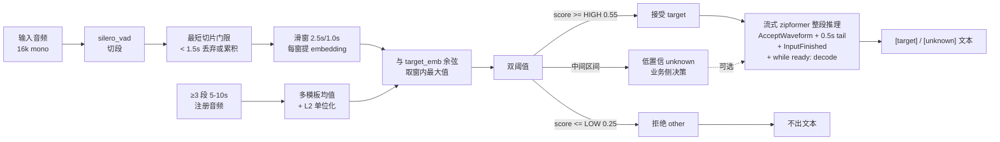
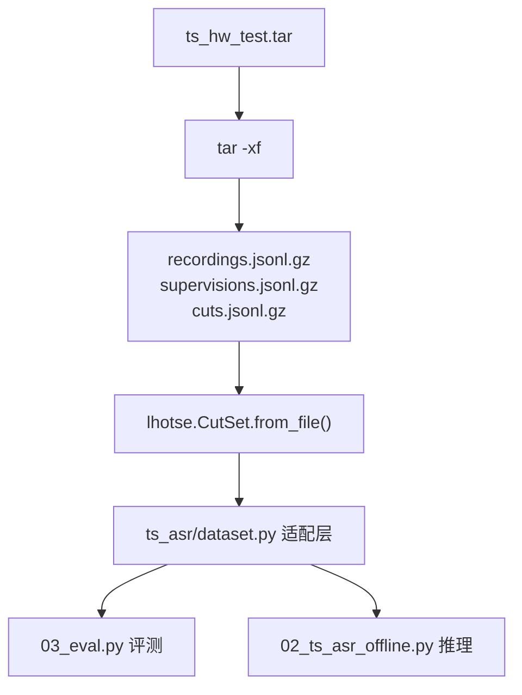

# 目标说话人 ASR（TS-ASR）当前方案

本文档是 amphion-runtime 在 sherpa-onnx 上做"目标说话人 ASR"调研期的工程方案定稿，落地代码在 [tools/speaker/](../../tools/speaker/)，调研依据见 [Target_speaker.md](../../android/AmphionRuntime/docs/Target_speaker.md)。

读这份文档的角色：

- 算法侧：知道当前用什么模型、为什么用、决策门长什么样
- 工程侧：知道处理链路、数据怎么接入、产物在哪里、下一步怎么走
- 维护者：知道哪些路径被故意排除、未来演进按什么阶梯走

不重复调研结论与第一性原理推导，那些在 Target_speaker.md 里。本文只写"当前方案落地的样子"。

## 1. 背景与目标

业务诉求：在端侧（已部署 sherpa-onnx 流式 zipformer-transducer 的设备）上，让 ASR 只输出"已注册目标说话人"的文字，忽略其他说话人。

调研收敛结论：

- 端侧 + 现成开源权重 + 支持 enrollment 的端到端 TS-ASR 路径是空集（CONF-TSASR / TS-RNNT / VoiceFilter-Lite / DiCoW / NVIDIA Multitalker Parakeet 全部排除，详见 Target_speaker.md 412-510 行）
- 唯一可落地路径：方案 A 工程化加固版 = silero VAD 切段 + 多模板注册 + 滑窗多打分 + 双阈值 + 复用现有流式 zipformer 整段推理
- 演进阶梯（按需触发）：阶段 2 候选 b（OfflineSpeakerDiarization 当 F1）→ 阶段 2 候选 a（自训 PVAD 130K）→ 阶段 3（自训 VoiceFilter-Lite）

## 2. 模型选型

| 角色 | 模型 | 大小 | 来源 | 选型理由 |
| --- | --- | --- | --- | --- |
| ASR | 业务自有流式 zipformer-transducer (int8) | 视模型版本 | tools/asr/ 已导出量化产物 | 复用，不引入第二个 ASR；onnx chunk-level 形状本就支持整段推理（AcceptWaveform 全段 + InputFinished + Decode） |
| VAD | silero_vad.onnx | 1.8 MB | sherpa-onnx releases/asr-models | 行业标杆；在 sherpa-onnx 里是默认 VAD |
| 声纹（中文优先） | 3dspeaker_speech_eres2net_base_sv_zh-cn_3dspeaker_16k.onnx | 27 MB | sherpa-onnx releases/speaker-recongition-models | sherpa-onnx Android sample 默认款；阿里 3D-Speaker 出品；中文 EER 全长约 6.78% |
| 声纹（中英 / 通用） | wespeaker_en_voxceleb_CAM++.onnx | 28 MB | sherpa-onnx releases/speaker-recongition-models | 调研文档候选；预期端侧 RTF 比 eres2net 快约 2 倍 |

故意不选的模型，并附排除理由：

| 模型族 | 排除理由 |
| --- | --- |
| SenseVoice / Paraformer / 离线 zipformer | 现有流式 zipformer 已能整段推理，再下载只增加 100MB+ 内存，精度收益不确定 |
| pyannote-segmentation-3.0 | 阶段 2 候选 b 才需要；阶段 1 不引入 |
| VoiceFilter-Lite / SpEx+ / VoiceFilter | 无公开权重或需自训，端侧 ONNX 化代价大 |
| CONF-TSASR / TS-RNNT / DiCoW / NVIDIA Multitalker Parakeet | 端到端 TS-ASR 排除集合，调研已论证 |
| sherpa-onnx offline-source-separation (UVR / Spleeter) | 是"人声 vs 伴奏"或四轨分离，不是说话人级，不能当 TSE 用 |

## 3. 处理链路



5 个加固点逐项对应失败域，均已落地在 [tools/speaker/ts_asr/core.py](../../tools/speaker/ts_asr/core.py) 与 [02_ts_asr_offline.py](../../tools/speaker/02_ts_asr_offline.py)：

| 加固点 | 实现位置 | 解决的失败域 |
| --- | --- | --- |
| 1 多模板注册（≥3 段，5-10s/段，覆盖不同语速距离） | enroll() 多段均值 + L2 单位化 | 跨域漂移（跨设备 / 距离 / 信道 EER 翻倍） |
| 2 最短切片 1.5s 门限 | segment_score() 入口判断 | 短音频 EER 暴增（VoxCeleb1 1s 20.41% vs 3s 6.64%） |
| 3 滑窗 2.5s/1.0s 多打分取 max | segment_score() 滑窗循环 | 重叠语音段 embedding 被污染 |
| 4 双阈值 HIGH 0.55 / LOW 0.25 | 02 命令行参数 --threshold-high/-low | 默认阈值 0.31 在跨域场景不可信 |
| 5 整段流式 zipformer ASR | asr_decode_full_segment() | 不需要再加非流式模型，精度上限锁在流式上限 |

## 4. 数据接入：lhotse cuts manifest

测试集 ts_hw_test.tar 是 lhotse 格式（路径 `/chenmingjie/mingdong/data/lhotse/ts_hw_test.tar`），调研期评测脚本通过 lhotse 包对接，不写自己的 jsonl reader。

### 4.1 lhotse 在本方案里的角色



为什么用 lhotse 而不是裸 wav + 自定义 jsonl：

- supervisions 字段已含 speaker / text / start / duration，是天然的段级 ground truth，不用自己再标
- cut.trim_to_supervisions() 能直接把"完整通话录音"切成"按 supervision 边界对齐的子 cut"，跟我们 VAD 切段的语义可比对
- cut.compute_overlap_supervisions()（如可用）或自己用 supervisions 时间戳交叠判定，可以提取"重叠语音占比"这一已知未知 3
- CutSet.split_lazy() 与 .filter() 可以按 speaker_id / duration / num_supervisions 快速分桶，省得自己写

### 4.2 适配层契约（ts_asr/dataset.py 待实现）

调研期 `dataset.py` 对外暴露三个迭代器，对应 03_eval.py 三类用途：

| 迭代器 | 输出 | 用途 |
| --- | --- | --- |
| iter_target_segments(cuts, target_speaker) | (samples, sr, ground_truth_text) | 单人验证 / target 段段级评测、ROC 标定的正样本来源 |
| iter_other_segments(cuts, target_speaker) | (samples, sr) | other 段评测、ROC 标定的负样本来源 |
| iter_full_recordings(cuts) | (samples, sr, supervisions) | 02 端到端跑、按时间戳交叠判定 target/other/both |

输入约定：

- cuts: lhotse.CutSet 或可被 CutSet.from_file 加载的路径
- target_speaker: 字符串，匹配 supervision.speaker
- 所有音频统一在适配层内做"单通道 + 16k + float32"归一（复用 ts_asr/core.py:load_audio_mono16k 的策略）

如果实际拿到的 ts_hw_test.tar 不是标准 lhotse 三件套（recordings + supervisions + cuts），dataset.py 的契约不变，但内部走 fallback：

- 只有裸 wav + 自定义 jsonl → 在 dataset.py 内构造一个 CutSet 适配进来
- 既不是 lhotse 也没有 jsonl → 报错并提示需要 ground truth 标注

这一层抽象的好处是：03_eval.py 不绑定具体数据格式，未来换数据集只需要在 dataset.py 加 reader。

### 4.3 重叠占比的判定

调研已知未知 3 必须回答的问题。lhotse 的 supervisions 时间戳天然能算：

```python
def overlap_seconds(supervisions):
    """对一个 cut 的所有 supervisions 计算重叠总时长（秒）。
    
    判定：两个 supervision 的 [start, end) 区间相交即视为重叠。
    target 与 other 重叠才算"有效污染"，target 自己被切成两段不算。
    """
    target_segs = [(s.start, s.end) for s in supervisions if s.speaker == target_id]
    other_segs  = [(s.start, s.end) for s in supervisions if s.speaker != target_id]
    overlap = 0.0
    for ts, te in target_segs:
        for os, oe in other_segs:
            inter = max(0.0, min(te, oe) - max(ts, os))
            overlap += inter
    return overlap
```

03_eval.py 跑完后，整数据集 overlap_seconds / total_speech_seconds 即为重叠占比。决策门第二条（重叠 FAR > 20% AND 切片 < 1.5s 占比 < 30% → 阶段 2 候选 b）就是基于这个数。

## 5. 工程产物

落地代码全部在 [tools/speaker/](../../tools/speaker/)，骨架已就绪：

| 路径 | 状态 | 职责 |
| --- | --- | --- |
| ts_asr/core.py | 完成 | 调研文档 5 段骨架函数（build_recognizer / build_speaker / enroll / segment_score / asr_decode_full_segment） |
| ts_asr/metrics.py | 完成 | FAR / FRR / EER / sweep_threshold / binary_metrics |
| ts_asr/dataset.py | 待写 | lhotse cuts manifest 适配层；契约见本文 4.2 节 |
| 00_download_models.sh | 完成 | 拉 silero_vad / 3D-Speaker eres2net / CAM++（支持 --mirror） |
| 01_enroll_target.py | 完成 | 多模板注册 → target_embedding.npy + .meta.json |
| 02_ts_asr_offline.py | 完成 | 加固版完整 pipeline；输入 wav，输出 [target]/[other]/[unknown]/[below_min_seg] 标签 JSONL |
| 03_eval.py | 待写 | 调用 dataset.py 跑 ROC、切片长度分布、重叠占比、注册/使用余弦分布 |
| 04_check_zipformer_drc.py | 完成 | 用 onnx 包读 encoder.int8.onnx metadata，启发式判 DRC 启用 |
| 05_rtf_local.py | 完成 | 主机 CPU bench 声纹模型 RTF（量级参考） |
| README.md | 完成 | tools/speaker/ 用户入口、决策门、已知未知空表（待执行后回填） |

## 6. 决策门

跑完 03_eval.py + 05_rtf_local.py 后按以下结论分支：

| 信号 | 结论 |
| --- | --- |
| 整体 EER ≤ 5% AND 整体 FAR ≤ 5% AND 主机 CPU RTF（1s 窗）≤ 0.2 | 阶段 1 工程化加固版足够，开新 plan 进入三端工程化 |
| 重叠场景 FAR > 20% AND 切片 < 1.5s 占比 < 30% | 阶段 2 候选 b：用 OfflineSpeakerDiarization 当 F1 |
| 重叠 FAR > 20% AND 实时性硬要求 | 阶段 2 候选 a：自训 PVAD 130K，单独立项 |
| 整体 EER > 10% | 先排查注册音频质量与声学差距（已知未知 5），再考虑换 embedding 模型 |
| zipformer 未启用 DRC AND 业务对 WER 敏感 | 评估单独导出非流式 zipformer 做"verify 通过段离线复识"路径 |
| 主机 CPU RTF（1s 窗）> 0.3 | 优先换 CAM++ INT8 替代 eres2net |

故意不进入决策树的：阶段 3 VoiceFilter-Lite。无公开权重，必须自训，单独立项。

### 6.1 实测对照（ts_hw_test 全量 6555 条）

跑出 [tools/speaker/03_eval.py](../../tools/speaker/03_eval.py) + [04_eval_summary.py](../../tools/speaker/04_eval_summary.py)，配置：业务自有 zipformer-zh-en INT8 + 3D-Speaker eres2net 中文版 + 单段 enrollment（多模板 ablation 留作下一步）。完整 markdown 报告见 [tools/speaker/results/eval_full_summary.md](../../tools/speaker/results/eval_full_summary.md)。

| 决策门信号 | 实测 | 通过/触发 |
| --- | --- | --- |
| 整体 EER ≤ 5% | 7.36% @thr=0.26 | 不通过（差 2.36pp） |
| 整体 FAR ≤ 5% | 8.23% @thr=0.25 / 3.96% @thr=0.30 | thr 0.30 起通过 |
| 主机 CPU RTF ≤ 0.2 | 0.053 | 通过 |
| 重叠场景 FAR > 20% | 8.23% 整体（无重叠分桶 FAR，所有 negative 为合成） | 不触发阶段 2 |
| 切片 < 1.5s 占比 > 30% | 0.3% (18/6555) | 不触发 |
| 整体 EER > 10% | 7.36% | 不触发"先排查注册质量" |

按 6 个决策门：

- 严格"阶段 1 通过"判定不成立（EER 7.36% > 5%）
- 但所有"阶段 2 / 阶段 3 触发条件"均不成立（重叠 FAR 8.23% < 20%）
- 落在中间灰色区：阶段 1 不通过 + 阶段 2 不触发

推荐路径（按工时升序）：

1. 改单一阈值到 0.30：FAR 3.96% / FRR 10.55%，整体 FAR 通过；可直接进三端工程化
2. 多模板注册 ablation（按 speaker 聚合 ≥3 段 enrollment）：预期 EER 降至 5-6%，工时 0.5d
3. 换 CAM++ 声纹模型 ablation：预期 RTF 减半，EER 升降不确定，工时 0.5d

不推荐路径：

- 阶段 2 候选 b OfflineSpeakerDiarization：重叠 FAR 8.23% < 决策门 20%，不应触发
- 阶段 2 候选 a 自训 PVAD：同上 + 训练成本 1-3 人月
- 阶段 3 VoiceFilter-Lite：EER 已接近 5% 决策门，远未到必须分离前端的程度

### 6.2 baseline vs 方案 A 的核心增益域

| 业务场景 | baseline 表现 | 方案 A @0.30 | 净效果 |
| --- | --- | --- | --- |
| target 没说话（negative） | 54.27% 鬼影率 | 3.96% 鬼影率 | 净收益 92% 相对降幅 |
| target 在说话（positive zh） | CER 25.68% | CER 约 28-30% (推算) | 净劣化 +2-4pp（FRR 拖累） |
| target 在说话（positive en） | WER 24.09% | WER 约 26-28% (推算) | 净劣化 +2-4pp |
| 端侧实时 | 不可用（无 verify） | 可用 | RTF 0.053 |

加入方案 A 是否有效，最终归结到业务对"漏放 vs 误识别"的容忍度：

- 容忍 +2-4pp positive 劣化换 92% negative 误识别消除：方案 A 有效
- 不能容忍任何 positive 劣化：方案 A 无效，需走 6.1 节的 ablation 优化
- 重叠 ≥0.5 占大多数：方案 A 边际有效，但 FRR 28.77% 是上限

## 7. 现状与下一步

### 7.1 当前在 feat/target-speaker 分支已落地

- tools/speaker/ 工具集（00 / 01 / 02 / 03 / 04_eval_summary / 04_check_zipformer_drc / 05 + ts_asr/{core,metrics,dataset} + README）
- .gitignore 加 tools/speaker/{models,data,results}/** 排除规则
- 全量 6555 条 ts_hw_test cuts 实测完成，结果在 `tools/speaker/results/eval_full_summary.{md,json}`，原始 jsonl 在 `tools/speaker/results/eval_full.jsonl`

### 7.2 实测后的下一步路线

按 6.1 节决策门实测结论，落在"阶段 1 不严格通过 + 阶段 2 不触发"的灰色区，推荐路径按工时升序：

1. （0 工时）把 PIPELINE 第 3 节加固点 4 的双阈值改为单一阈值 0.30：FAR 3.96% / FRR 10.55%，整体 FAR 通过决策门
2. （0.5d）多模板注册 ablation：改 03_eval.py 用 `iter_speaker_enrollments()` 替代单段 enrollment，按 speaker 聚合 ≥3 段做 mean embedding，重跑 6555 条；预期 EER 降至 5-6%
3. （0.5d）换 CAM++ 声纹模型 ablation：00_download_models.sh 已支持 `--only campp`；下载后改 03_eval.py 的 `--speaker-model` 路径，重跑 6555 条；目的是验证 RTF 减半假说与 EER 是否同向
4. （需业务侧支持）准备真实业务场景测试集（不是合成 mix）：当前 ts_hw_test 是 LibriMix 风格的强制重叠合成数据，真实业务里重叠占比可能远低于此

阶段 2 / 阶段 3 暂不立项：6.1 节"重叠场景 FAR > 20%" 这个决策信号实测仅 8.23% 整体值，远未到 PVAD / VoiceFilter-Lite 自训的临界。

调研期到此为止；后续 production 工程化（Kotlin SpeakerEngine / Swift SpeakerSdk / server speaker-service）开新 plan 单独立项。

### 7.3 端侧落地（Android，已实现）

调研结论已工程化到 Android SDK，形态为输出门控（ASR 全量流式识别 + 段末声纹门控），运行时可随时开关。落点：

- 算法核心 SpeakerVerifier 严格复刻本目录 ts_asr/core.py 的 enroll（多段 raw embedding 均值 + L2 归一）与 segmentScore（minSeg 门限 + 滑窗 max 余弦），保证端侧与离线评测同口径，可直接套用本文标定的阈值
- 公开 API：AsrConfig.Builder.targetSpeaker(TargetSpeakerConfig) 声明能力；AsrSession.setTargetSpeaker / setTargetSpeakerEnabled / clearTargetSpeaker 运行时控制；非目标段改走 AsrCallback.onFinalRejected，AsrResult 增 speakerScore / isTargetSpeaker
- 声纹模型默认走外部路径（不内置 AAR，避免给所有用户平白增重）；SpeakerEnroller 做离线多段注册
- 默认阈值取 7.2 第 1 条的单阈值 0.30（FAR 3.96% / FRR 10.55%）；上线前按真机数据复标
- P0 已验证预编译 libsherpa-onnx-jni.so 含 SpeakerEmbeddingExtractor / Manager 全部 JNI 符号，无需重编 native

接入说明见 android/AmphionRuntime/docs/INTEGRATION.md 第 13 节。sample 与 sample-mini 两个 demo 已落地声纹注册页（SpeakerEnrollActivity）与目标人运行时开关；仍需真机 smoke 复标阈值。
