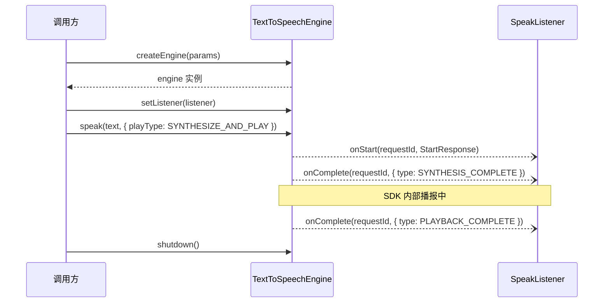
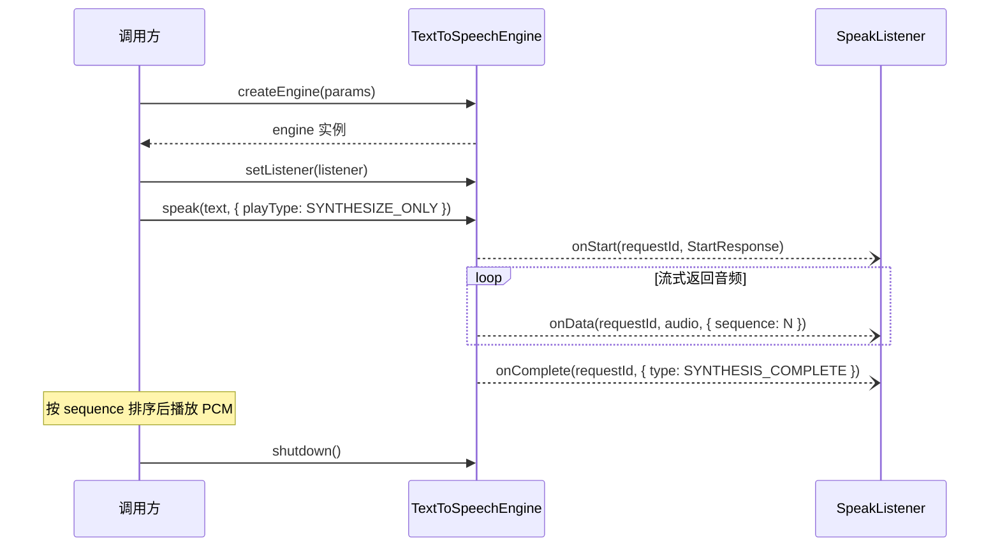
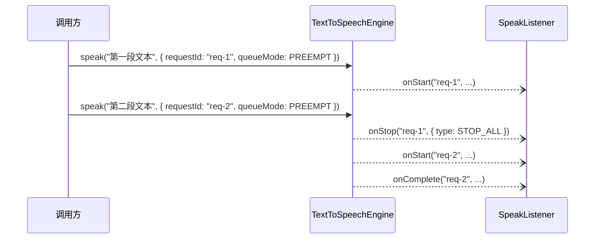
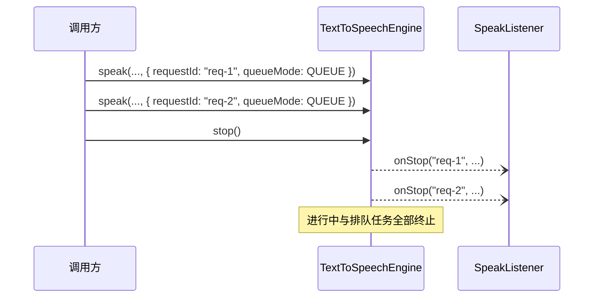

# 语音合成 SDK 接口文档

> 本文档为**语言无关的抽象接口定义**，不绑定具体平台或实现语言。
> 参考来源：华为 HarmonyOS Core Speech Kit — `textToSpeech` API（ArkTS）

---

## 概述

语音合成 SDK 提供将文本转换为语音的能力，支持**合成音频流输出**与**系统播报**两种模式，通过事件回调通知合成与播报进度，适用于语音助手播报、智能体回复朗读等场景。

**约束**

| 项目 | 说明 |
|------|------|
| 语种 | 中英（`zh-en`） |
| 运行模式 | 离线（`OFFLINE`），当前仅支持离线 |
| 输出音频格式 | PCM，24000 Hz，16bit |
| 单次文本长度 | 1 ~ 10000 字符（不含文本首尾空格） |
| 引擎实例数 | 同一设备上所有应用合计最多 3 个实例  // 待定 |
| requestId | 同一引擎实例内，每条请求的 `requestId` 不可重复 |

> 当前模型支持中英混合播报。
>
> 1. 如何进行纯英文播报？
> 2. 如何处理中文语境下的数字播报风格？“在2楼” -> ”在二楼“ or “在two楼”
> 3. 同一设备上所有应用合计最多几个实例？

---

## 接口列表

| # | 接口 | 所属对象 | 说明 |
|---|------|----------|------|
| 1 | `createEngine` | `TextToSpeechSdk` | 创建并初始化引擎实例 |
| 2 | `listVoices` | `TextToSpeechSdk` | 查询当前支持的语种与音色 |
| 3 | `setWorkPath` | `TextToSpeechSdk` | 指定 SDK 文件读写工作路径 |
| 4 | `setListener` | `TextToSpeechEngine` | 注册合成/播报回调监听器 |
| 5 | `speak` | `TextToSpeechEngine` | 提交文本，执行合成并/或播报 |
| 6 | `stop` | `TextToSpeechEngine` | 停止全部合成/播报，清空排队队列 |
| 7 | `isBusy` | `TextToSpeechEngine` | 查询引擎繁忙状态 |
| 8 | `shutdown` | `TextToSpeechEngine` | 销毁引擎，释放资源 |

---

## 一、创建引擎

### 方法签名

```
TextToSpeechSdk.createEngine(params: CreateEngineParams, callback: Callback<TextToSpeechEngine>) -> void
TextToSpeechSdk.createEngine(params: CreateEngineParams) -> Promise<TextToSpeechEngine>
```

> 支持回调和 Promise 两种异步模式，实现语言按实际能力选择其一或同时提供。

### 参数说明

| 参数 | 类型 | 必填 | 说明 |
|------|------|------|------|
| params | CreateEngineParams | 是 | 引擎初始化配置，见 [CreateEngineParams](#createengineparams) |
| callback | Callback\<TextToSpeechEngine\> | 否 | 异步回调；与 Promise 模式二选一 |

### 返回值

| 类型 | 说明 |
|------|------|
| TextToSpeechEngine | 已初始化的引擎实例 |

### 错误码

| 错误码 | 说明 |
|--------|------|
| 1002300002 | 语种不支持 |
| 1002300003 | 音色不支持 |
| 1002300005 | 创建引擎失败（资源不存在、初始化超时等） |
| 1002300006 | 引擎实例数已达上限 |
| 1002300008 | 引擎已被销毁 |
| 1002300009 | 内部服务错误 |

### 伪代码示例

```pseudocode
params = CreateEngineParams {
    language: "zh-en",
    mode: OFFLINE,
    voiceId: "lits-female-01",
    locate: "CN",
    engineName: "xiaoqiao-tts"
}

engine = TextToSpeechSdk.createEngine(params)
```

---

## 二、查询音色

### 方法签名

```
TextToSpeechSdk.listVoices(params: VoiceQuery, callback: Callback<VoiceInfo[]>) -> void
TextToSpeechSdk.listVoices(params: VoiceQuery) -> Promise<VoiceInfo[]>
```

查询当前 SDK 支持的语种与音色列表。音色资源须已随系统或应用预置，本接口不提供下载能力。

### 参数说明

| 参数 | 类型 | 必填 | 说明 |
|------|------|------|------|
| params | VoiceQuery | 是 | 查询条件，见 [VoiceQuery](#voicequery) |
| callback | Callback\<VoiceInfo[]\> | 否 | 异步回调；与 Promise 模式二选一 |

### 返回值

| 类型 | 说明 |
|------|------|
| VoiceInfo[] | 匹配的音色信息列表，见 [VoiceInfo](#voiceinfo) |

### 伪代码示例

```pseudocode
voices = TextToSpeechSdk.listVoices(VoiceQuery {
    requestId: "query-001",
    mode: OFFLINE,
    language: "zh-en"
})
```

---

## 三、指定工作路径

### 方法签名

```
TextToSpeechSdk.setWorkPath(workPath: String) -> void
```

为 SDK 指定文件系统工作目录。SDK 存在持久化文件读写需求（如模型缓存、日志）时，统一读写此路径；调用方须确保该路径对 SDK 进程可读写。

> 应在 `createEngine` 之前调用；若不调用，SDK 使用平台默认路径（不同实现平台行为不同）。

### 参数说明

| 参数 | 类型 | 必填 | 说明 |
|------|------|------|------|
| workPath | String | 是 | 分配给 SDK 的可读写目录路径 |

---

## 四、注册监听器

### 方法签名

```
engine.setListener(listener: SpeakListener) -> void
```

> **必须**在调用 `speak` 之前设置，否则无法收到合成/播报进度与错误回调。

### 参数说明

| 参数 | 类型 | 必填 | 说明 |
|------|------|------|------|
| listener | SpeakListener | 是 | 回调对象，见 [SpeakListener](#speaklistener) |

---

## 五、合成播报

### 方法签名

```
engine.speak(text: String, params: SpeakParams) -> void
```

提交待合成文本。根据 `playType` 配置，引擎仅返回音频流，或由 SDK 内部完成播报。

### 参数说明

| 参数 | 类型 | 必填 | 说明 |
|------|------|------|------|
| text | String | 是 | 待合成文本，长度 1 ~ 10000 字符（不含首尾空格） |
| params | SpeakParams | 是 | 合成/播报配置，见 [SpeakParams](#speakparams) |

### 错误码

| 错误码 | 说明 |
|--------|------|
| 1002300001 | 文本为空或长度超出范围 |
| 1002300002 | 语种不支持 |
| 1002300003 | 音色不支持 |
| 1002300007 | 引擎未初始化 |
| 1002300010 | 引擎繁忙且 `queueMode` 为 `QUEUE` 时队列已满（实现可选） |

### 伪代码示例

```pseudocode
engine.speak("您好，有什么可以帮您？", SpeakParams {
    requestId: "req-001",
    speed: 1.0,
    volume: 1.0,
    pitch: 1.0,
    languageContext: "zh-CN",
    audioType: "pcm",
    playType: SYNTHESIZE_AND_PLAY,
    queueMode: PREEMPT
})
```

---

## 六、停止合成/播报

### 方法签名

```
engine.stop() -> void
```

立即停止**全部**进行中的合成/播报，并清空排队队列。**不销毁引擎**；释放引擎资源请调用 `shutdown()`。

### 错误码

| 错误码 | 说明 |
|--------|------|
| 1002300007 | 引擎未初始化 |

### 伪代码示例

```pseudocode
engine.stop()
```

---

## 七、查询繁忙状态

### 方法签名

```
engine.isBusy() -> Boolean
```

### 返回值

| 返回值 | 说明 |
|--------|------|
| true | 引擎当前处于合成或播报状态 |
| false | 引擎空闲，可发起新请求 |

---

## 八、销毁引擎

### 方法签名

```
engine.shutdown() -> void
```

释放引擎占用的所有资源（模型、线程、内存等）。调用后不可再使用该实例，需重新调用 `createEngine`。

---

## 数据结构

### CreateEngineParams

引擎初始化配置。

| 字段 | 类型 | 必填 | 说明 |
|------|------|------|------|
| language | String | 是 | 合成语种<br />`"zh-en"`: 中英<br />`"en-US"`: 英文 |
| mode | RunMode | 是 | 运行模式，当前仅支持 `OFFLINE` |
| voiceId | String | 是 | 音色标识，有效范围通过 `listVoices` 获取 |
| ~~style~~ | ~~String~~ | ~~否~~ | ~~播报风格，默认 `"interaction-broadcast"`（交互广播风格）~~ |
| locate | String | 否 | 区域信息，默认 `"CN"` |
| engineName | String | 否 | 引擎实例名称，用于多实例区分；不可使用随机字符串 |
| extraParams | Map\<String, Any\> | 否 | 扩展参数，供实现方预留 |

---

### VoiceQuery

音色查询条件。

| 字段 | 类型 | 必填 | 说明 |
|------|------|------|------|
| requestId | String | 是 | 请求唯一标识 |
| mode | RunMode | 是 | 查询的运行模式，当前仅支持 `OFFLINE` |
| language | String | 否 | 过滤语种；不填时返回全量列表 |
| extraParams | Map\<String, Any\> | 否 | 扩展参数 |

---

### VoiceInfo

音色信息。

| 字段 | 类型 | 必填 | 说明 |
|------|------|------|------|
| language | String | 是 | 语种，如 `"zh-en"`、`"en-US"` |
| voiceId | String | 是 | 音色标识 |
| gender | String | 是 | 性别：`"Male"` / `"Female"` |
| description | String | 否 | 音色描述（角色属性、适用场景等） |

---

### SpeakParams

单次合成/播报请求配置。

| 字段 | 类型 | 必填 | 说明 |
|------|------|------|------|
| requestId | String | 是 | 请求唯一标识，同一引擎实例内不可重复 |
| speed | Float | 否 | 语速，范围 [0.5, 2.0]，默认 `1.0` |
| volume | Float | 否 | 音量，范围 [0.0, 2.0]，默认 `1.0` |
| pitch | Float | 否 | 音调，范围 [0.5, 2.0]，默认 `1.0` |
| languageContext | String | 否 | 数字朗读语境，支持 `"zh-CN"` / `"en-US"`，默认 `"zh-CN"` |
| audioType | String | 否 | 输出音频类型，当前仅支持 `"pcm"`，默认 `"pcm"` |
| playType | PlayType | 否 | 合成模式，默认 `SYNTHESIZE_AND_PLAY` |
| soundChannel | Int | 否 | 播报音频通道；`playType` 为 `SYNTHESIZE_AND_PLAY` 时有效，默认由平台决定 |
| queueMode | QueueMode | 否 | 播报排队策略，默认 `QUEUE` |
| extraParams | Map\<String, Any\> | 否 | 扩展参数 |

---

### StartResponse

播报开始时返回的音频参数。

| 字段 | 类型 | 必填 | 说明 |
|------|------|------|------|
| audioType | String | 是 | 音频类型，当前仅支持 `"pcm"` |
| sampleRate | Int | 是 | 采样率（Hz），当前仅支持 `24000` |
| sampleBit | Int | 是 | 采样位深（bit），当前仅支持 `16` |
| audioChannel | Int | 是 | 声道数 |
| compressRate | Int | 是 | PCM 格式固定为 `0` |

---

### SynthesisResponse

流式音频片段的元信息。

| 字段 | 类型 | 必填 | 说明 |
|------|------|------|------|
| sequence | Int | 是 | 音频片段序号，从 `0` 递增，取值范围 [0, Int.MAX] |
| audioType | String | 是 | 音频类型，当前仅支持 `"pcm"` |

> 跨进程通信可能导致 `onData` 回调乱序，调用方须按 `sequence` 排序后再播放或拼接。

---

### CompleteResponse

合成或播报完成时的附加信息。

| 字段 | 类型 | 必填 | 说明 |
|------|------|------|------|
| type | CompleteType | 是 | 完成阶段类型 |
| message | String | 是 | 描述信息，长度 [0, 30] |

---

### StopResponse

停止操作完成时的附加信息。

| 字段 | 类型 | 必填 | 说明 |
|------|------|------|------|
| type | StopType | 是 | 停止范围类型 |
| message | String | 是 | 描述信息，长度 [0, 30] |

---

## 枚举类型

### RunMode

| 值 | 说明 |
|----|------|
| `OFFLINE` | 离线模式（当前唯一支持值） |
| `ONLINE` | 在线模式（预留，当前不支持） |

---

### PlayType

| 值 | 说明 |
|----|------|
| `SYNTHESIZE_ONLY` | 仅合成，通过 `onData` 返回音频流，不触发系统播报 |
| `SYNTHESIZE_AND_PLAY` | 合成并由 SDK 内部播报，默认不通过 `onData` 返回音频流 |

> 当 `playType` 为 `SYNTHESIZE_ONLY` 时，调用方负责接收 `onData` 并自行播放；`onStart` 仍返回音频格式参数供播放器初始化。

---

### QueueMode

| 值 | 说明 |
|----|------|
| `QUEUE` | 排队模式：新请求等待当前请求完成后执行 |
| `PREEMPT` | 抢占模式：新请求立即打断当前合成/播报 |

---

### CompleteType

| 值 | 说明 |
|----|------|
| `SYNTHESIS_COMPLETE` | 合成结束 |
| `PLAYBACK_COMPLETE` | 播报结束 |

> 一次 `speak` 请求可能先后触发两次 `onComplete`：先 `SYNTHESIS_COMPLETE`，再 `PLAYBACK_COMPLETE`（`playType` 为 `SYNTHESIZE_AND_PLAY` 时）。  

---

### StopType

| 值 | 说明 |
|----|------|
| `STOP_ALL` | 同时停止合成与播报 |
| `STOP_PLAYBACK_ONLY` | 仅停止播报，合成继续进行（实现可选） |

---

## SpeakListener

合成/播报过程回调接口，所有事件均通过此接口异步通知调用方。

### onStart

```
onStart(requestId: String, response: StartResponse) -> void
```

合成/播报开始时触发，返回音频格式参数。

| 参数 | 说明 |
|------|------|
| requestId | 请求唯一标识 |
| response | 音频参数，见 [StartResponse](#startresponse) |

---

### onData

```
onData(requestId: String, audio: ByteArray, response: SynthesisResponse) -> void
```

合成过程中流式返回音频数据。**可选实现**；当 `playType` 为 `SYNTHESIZE_ONLY` 时调用方应实现此回调。

| 参数 | 说明 |
|------|------|
| requestId | 请求唯一标识 |
| audio | PCM 音频片段 |
| response | 片段元信息，见 [SynthesisResponse](#synthesisresponse) |

---

### onComplete

```
onComplete(requestId: String, response: CompleteResponse) -> void
```

合成结束或播报结束时触发。

| 参数 | 说明 |
|------|------|
| requestId | 请求唯一标识 |
| response | 完成信息，见 [CompleteResponse](#completeresponse) |

---

### onStop

```
onStop(requestId: String, response: StopResponse) -> void
```

调用 `stop()` 且对应任务停止完成后触发。停止全部时，**每条**被停止的请求各触发一次。

| 参数 | 说明 |
|------|------|
| requestId | 请求唯一标识 |
| response | 停止信息，见 [StopResponse](#stopresponse) |

---

### onError

```
onError(requestId: String, errorCode: Int, errorMessage: String) -> void
```

合成/播报过程中出现错误时触发。

| 参数 | 说明 |
|------|------|
| requestId | 请求唯一标识 |
| errorCode | 错误码，见 [错误码总表](#错误码总表) |
| errorMessage | 错误描述 |

---

## 错误码总表

| 错误码 | 说明 | 触发阶段 |
|--------|------|----------|
| 1002300001 | 文本为空或长度超出范围 | speak |
| 1002300002 | 语种不支持 | createEngine / speak |
| 1002300003 | 音色不支持 | createEngine / speak |
| 1002300005 | 创建引擎失败 | createEngine |
| 1002300006 | 引擎实例数已达上限 | createEngine |
| 1002300007 | 引擎未初始化 | speak / stop |
| 1002300008 | 引擎已被销毁 | createEngine |
| 1002300009 | 内部服务错误 | createEngine / 运行时 |
| 1002300010 | 队列已满（`queueMode=QUEUE` 时，实现可选） | speak |
| 1002300011 | 合成/播报运行时异常 | 运行时 |

---

## 典型调用时序

### 合成并播报（SDK 内部播放）



### 仅合成（调用方自行播放）



### 抢占模式打断



### 主动停止全部



---

## 伪代码完整示例

```pseudocode
// 0. 查询可用音色（可选）
voices = TextToSpeechSdk.listVoices(VoiceQuery {
    requestId: "query-001",
    mode: OFFLINE,
    language: "zh-en"
})

// 1. 指定工作路径（可选）
TextToSpeechSdk.setWorkPath("/data/tts/")

// 2. 创建引擎
params = CreateEngineParams {
    language: "zh-en",
    mode: OFFLINE,
    voiceId: "lits-female-01",
    engineName: "xiaoqiao-tts"
}
engine = TextToSpeechSdk.createEngine(params)

// 3. 注册回调
engine.setListener(SpeakListener {
    onStart(requestId, response):
        log("开始 requestId=" + requestId
            + " sampleRate=" + response.sampleRate)

    onData(requestId, audio, response):
        // playType=SYNTHESIZE_ONLY 时按 sequence 缓存并播放
        buffer.put(response.sequence, audio)

    onComplete(requestId, response):
        if response.type == SYNTHESIS_COMPLETE:
            log("合成完成 requestId=" + requestId)
        if response.type == PLAYBACK_COMPLETE:
            log("播报完成 requestId=" + requestId)

    onStop(requestId, response):
        log("已停止 requestId=" + requestId)

    onError(requestId, code, msg):
        log("错误 code=" + code + " msg=" + msg)
})

// 4. 合成播报
engine.speak("您好，有什么可以帮您？", SpeakParams {
    requestId: "req-001",
    speed: 1.0,
    volume: 1.0,
    pitch: 1.0,
    playType: SYNTHESIZE_AND_PLAY,
    queueMode: PREEMPT
})

// 5. 停止（可选）
engine.stop()

// 6. 释放资源
engine.shutdown()
```

---
